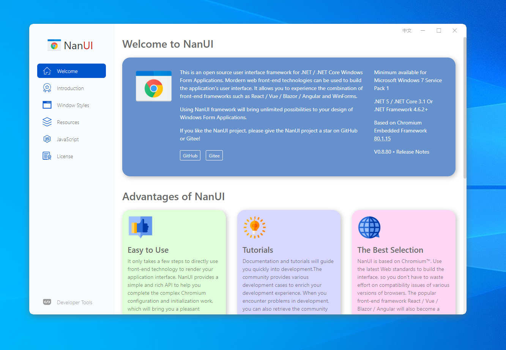

# NanUI

[中文](README.md) | English

**More**

https://github.com/NetDimension/NanUI/

https://gitee.com/linxuanchen/NanUI/

https://www.formium.net/

---

## What's this

NanUI is an open source .NET/.NET Core component for Windows Form Applications. It's suitable for .NET/.NET Core developers who wants to use front-end technologies suc as HTMM5/CSS3/JavaScript to design the user interface of Windows Form Applications.

WinFormium, the rendering engine of NanUI is based on Chromium Embedded Framework, so you can use various front-end technologies (HTML5/CSS3/JavaScript) and frameworks (React/Vue/Angular/Blazor) to design and develop user interface of .NET desktop applications.

And WinFormium's JavaScript Bridge can easily and concisely relize the communication and data exchanges between the browser and .NET enviroment.

Using NanUI will bring you unlimited possibilities for designing and developmenting the UI of traditional WinForm applications!

If you want to know more about NanUI project, please go to [NanUI Introduction](docs/README.md).

**If you like NanUI project, please light up a star⭐ for this project!**

Please consider rewarding the project author or sponsoring the project so that the NanUI project can be developed and iterated continuously. Thank you for your support and attention!

### Current Version：

- **Chromium** `80.0.3987.163`
- **NanUI** `0.8.80.120` 

### Requirement

- Windows 7 x86/x64 Service Pack 1 or newer

### Platforms

- .NET 4.6.2/4.7/4.7.1/4.7.2/4.8
- .NET Core 3.1
- .NET 5.0

### Compile the source code

NanUI supports the framework from .NET 4.6.2 to the latest .NET 5.0, if you need to compile NanUI source code, you need to use __Visual Studio 2019 16.8 or higher__, and you need to install the corresponding .NET framework version:

- .NET 4.6.2/4.7/4.7.1/4.7.2/4.8 SDK
- .NET Core 3.1 SDK
- .NET 5.0 SDK

If you only want to compile NanUI for a specific framework platform, please modify the `TargetFrameworks` property value in the project file yourself.

---

## Getting Start

If you want to learn more about NanUI or want to use NanUI for development as soon as possible, please navigate to [Welcome to NanUI](docs/README.md) to get documentation and sample code.

The source code contains a sample project FormiumClient, you can quickly learn the relevant knowledge of NanUI through the source code of this project, it will also teach you how to use HTML / CSS / JavaScript to create your application.

- [formium-client-frontend](src/formium-client-frontend/README.md)

  The front-end code of this project uses two hot frameworks, ReactJS and Bootstrap.

- [FormiumClient](src/FormiumClient/README.md)

  This project mainly shows you some examples of NanUI's form types, the use of resource controllers to load resources, and the communication between NanUI and JavaScript.

## License

NanUI is MIT licensed. **The copyright of NanUI project is owned by the project's founder and developer Xuanchen Lin**.

Follow the MIT:

You should keep the copyright information of NanUI in your derivative project: `Powered by NanUI`.

For more details of MIT [please see](docs/en-US/License.md). The NanUI project is based on many open source projects, for dependency licenses [please see](docs/en-US/Dependences.md)。

---

## Reward and Sponsorship

The NanUI project is an open source project based on the LGPL-3.0 agreement and it is completely free. Without proper financial support, project maintenance and the development of new features cannot be sustained. So if you like this project and approve of my work, you buy me a cup of coffee, or you can become a long-term project sponsor to help NanUI better.

Use WeChat or Alipay to scan the QR code below to make a donation.

If you are not in China, please click the icon below to jump to the PayPal to make a donation.

