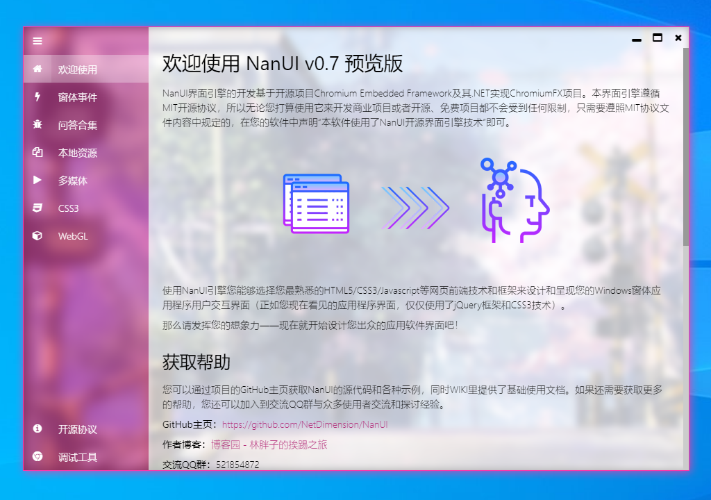

# NanUI 

[中文] | [[English](./README.en-US.md)]


## 简介




### NanUI 项目

**NanUI**是一个开放源代码的.NET项目，它适用于希望使用HTML5 / CSS3等前端技术来构建Windows窗体应用用户界面的.NET / .NET Core开发人员。它的底层基于[ChromiumFX](https://bitbucket.org/chromiumfx/chromiumfx)开源项目。

### Formium 引擎

**Formium**是NanUI项目的核心，Formium专注于使用HTML5/CSS3/Javascript等Web前端技术来构建桌面应用程序的用户界面，他将为软件界面设计工作带来无限可能。

使用Formium引擎，你可以使用任何你所熟悉的前端技术来搭建用户界面。但强烈建议你使用单页应用（SPA）模式来制作界面，因为这可以给用户带来更好的操作体验。主流的Javascript框架，比如Angular, React, Vue都是可以用来构架SPA应用的明智选择。更多的Formium应用程序实例，请移步[Formium-Demos](https://github.com/NetDimension/Formium-Demos)。

如果你喜欢NanUI项目，请为NanUI项目点亮一颗星！

## 更新

如果您需要了解最近更新的日志信息，请查看[日志文档](./src/changelog.md)。

## 帮助文档

帮助文档将帮助你轻松快速的开始使用Formium引擎进行开发。如果你愿意帮助翻译不同语言的文档，请与我取得联系，感激不敬。 

- [中文文档](https://docs.formium.net)
- [NanUI 技术内幕](https://zhuanlan.zhihu.com/nanui)@知乎

## 教学视频

后期将陆续更新《NanUI 入门教程》系列视频以及《NanUI 案例实战》系列视频，您可以访问以下网站收看。

- [B站](https://space.bilibili.com/396855974/channel/detail?cid=113298)
- [西瓜](https://www.ixigua.com/pseries/6804465191196033540_6798031330459255303/)

## 使用 NanUI

稳定版的库文件我会上传到NuGet平台，你可以通过NuGet的包管理器来安装NanUI到你的项目中。与之关联的对应版本的CEF和CFX依赖项目也会自动拷贝到项目文件夹中。

**.NET Framework 4.0+ / .NET CORE 3.1**

NetDimension.NanUI.dll最小支持到Microsft .NET Framework 4.0版本

```
PM> Install-Package NetDimension.NanUI
```

**请注意!** 与之前发布的NanUI库不同， 新版本将不再支持Windows XP系统。如果有使用XP的需求，请继续使用0.6版本。


## 创建一个最简单的应用

初始化NanUI的启动环境。

```C#
using NetDimension.NanUI;

class Program
{
   [STAThread]
   static void Main(string[] args)
   {
      // ...
      Bootstrap
        .Initialize()
        .Run(()=>new MainWindow());
    }
}
```

使用浏览器承载窗口，例子中将使用一个原生样式的窗口来打开微软必应。
```C#

using NetDimension.NanUI;

class MainWindow : Formium
{
  // 设置承载窗口启动时加载的网址
  public override string StartUrl => "https://www.bing.com";

  // 设置承载窗口的样式，此处设置为使用原生样式的窗口 
  public override HostWindowType WindowType =>  HostWindowType.Standard;

  // 如果需要在首次加载网页时添加启动屏幕，在此处返回启动屏幕的控件实例
  protected override Control LaunchScreen => null;

  public MainWindow()
  {
      // 设置窗口基础标题
      Title = "NanUI Application";
  }

  // 浏览器核心准备就绪
  protected override void OnWindowReady(IWebBrowserHandler browserClient)
  {
    // 在此处添加CEF客户端各项行文的处理子程序，例如：下载（通常使用DownloadHandler处理下载过程）、弹窗（LiftSpanHandler）、信息显示（DisplayHandler）等等。
  }

  // 浏览器Javascript环境初始化完成
  protected override void OnRegisterGlobalObject(JSObject global)
  {
      // 可以在此处将C#对象注入到当前窗口的JS上下文中
  }

  // 在此处定义标准窗口的基础样式
  protected override void OnStandardFormStyle(IStandardHostWindowStyle style)
  {
    // Define the basic style of the standard window here
    style.MinimumSize = new System.Drawing.Size(1024, 640);
    style.Size = new System.Drawing.Size(1280, 720);
    style.Icon = <Icon File>;
  }
}
```


## 关于我

各位朋友大家好，我是 NanUI 的作者林选臣，网名 Mr.JSON。本人毕业于西南林业大学计算机与科学技术专业。曾跟大学兄弟一起创过业，写过网站，接过项目；也在本地的各种互联网企业、软件企业摸爬滚打混迹过很多年。目前给自己的评价是：边疆小城里碌碌无为的卢瑟程序员！

我是一个开朗的人，这得益于养育我的父母，爱我的老婆。能够每天开心的活着，高高兴兴的写着代码，我已感到满足。


## 资助项目
NanUI是一个基于MIT协议的开源项目并且它是完全免费的。尽管如此，如果没有适当的资金支持，项目维护和新功能的开发是无法持续下去的。所以如果你喜欢这个项目并认可我的工作，你可以支付我一杯咖啡的钱请我喝一杯咖啡，或者你也可以成为长期的项目资助人以帮助NanUI变得更好。

使用微信或者支付宝扫描下方二维码来进行资金方面的捐助。


海外用户请通过点击下方图标连接到PayPal平台进行捐助。

[](https://www.paypal.me/mrjson)

**NanUI的发展需要你的支持，谢谢！**
