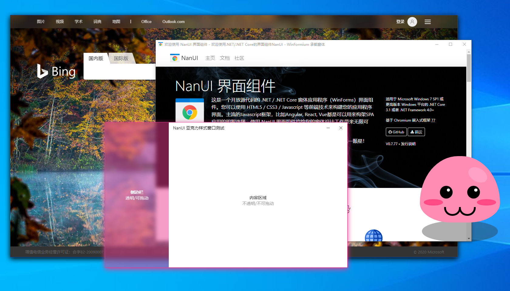
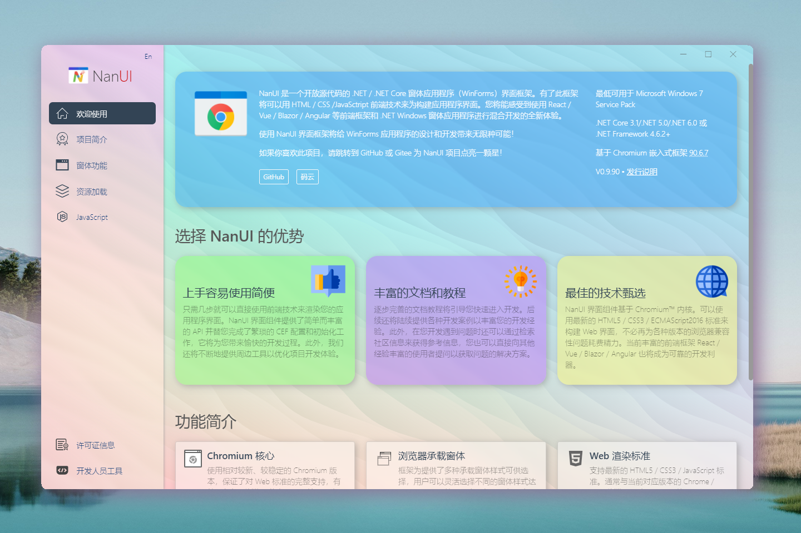

# NanUI

中文 | [English](README.en-US.md)

**更多地址**

https://github.com/NetDimension/NanUI/

https://gitee.com/linxuanchen/NanUI/

https://www.formium.net/

---

## 关于 NanUI

NanUI 界面组件是一个开放源代码的 .NET / .NET Core 窗体应用程序（WinForms）界面组件。她适用于希望使用 HTML5/CSS3 等前端技术来构建 Windows 窗体应用程序用户界面的 .NET/.NET Core 开发人员。

NanUI 的渲染引擎 WinFormium 基于谷歌可嵌入的浏览器框架 Chromium Embedded Framework，因此用户可以使用各种前端技术 HTML5/CSS3/JavaScript 和框架 React/Vue/Angular/Blazor 设计和开发.NET 桌面应用程序的用户界面。

同时，WinFormium 特有的 JavaScript Bridge 可以方便简洁地实现浏览器端与 .NET 之间的通信和数据交换。

使用 NanUI 界面框架将为传统的 WinForm 应用程序的用户界面设计和开发工作带来无限种可能！

**如果你喜欢 NanUI 项目，请为本项点亮一颗星 ⭐！**

此外也请您考虑打赏项目作者或者为项目提供赞助，以便 NanUI 项目得以长期开发和持续迭代，感谢您的支持和关注！

### 当前 NanUI 版本：

- **Chromium** `80.0.3987.163`
- **NanUI** `0.8.80.120` 

### 运行要求

- Windows 7 x86/x64 SP1 或更新版本的系统

### 支持框架

- .NET 4.6.2/4.7/4.7.1/4.7.2/4.8
- .NET Core 3.1
- .NET 5.0

### 编译源码

因为 NanUI 支持从 .NET 4.6.2 到最新的 .NET 5.0 框架，所以如需要编译 NanUI 源码需要使用 __Visual Studio 2019 16.8 或更高版本__，并且需要安装对应的 .NET 框架版本：

- .NET 4.6.2/4.7/4.7.1/4.7.2/4.8 SDK
- .NET Core 3.1 SDK
- .NET 5.0 SDK

如果您只希望编译特定框架平台的 NanUI，请自行修改项目文件（.csproj）中的 `TargetFrameworks` 属性值。

---

## 入门

如果想进一步了解有关 NanUI 的更多信息或者想使用 NanUI 尽快进行开发工作，请访问《[欢迎使用 NanUI](docs/README.md)》来获取文档帮助和示例代码。

在项目源代码中包括了一个综合性的展示项目 FormiumClient，您可以通过这个项目的源代码快速学习 NanUI 的相关知识并掌握如何使用 HTML / CSS / JavaScript 来创建您的应用程序。

- [formium-client-frontend](src/formium-client-frontend/README.md)

  此项目的前端代码，使用了 ReactJS 和 Bootstrap 两个主流的框架。

- [FormiumClient](src/FormiumClient/README.md)

  此项目主要为您展示了 NanUI 的窗体类型、使用资源控制器加载资源以及 NanUI 与 JavaScript 进行通信的一些例子。

---

## 版权和协议

NanUI 项目基于 MIT 开源协议开放项目源代码。**本项目版权由项目发起人、开发者林选臣所有**。

依照 MIT 协议规定您需要在您的衍生项目中保留 NanUI 的版权信息：`Powered by NanUI`。

关于 MIT 协议的具体内容请参考此协议[详细副本](docs/zh-CN/License.md)。此外，NanUI 项目基于诸多开源项目进行构建，相关的项目请查阅[第三方授权协议](docs/zh-CN/Dependences.md)。

---

## 打赏和赞助

NanUI 项目基于 MIT 协议的开源项目并且它是完全免费的。尽管如此，如果没有适当的资金支持，项目维护和新功能的开发是无法持续下去的。所以如果你喜欢这个项目并认可我的工作，你可以支付我一杯咖啡的钱请我喝一杯咖啡，或者你也可以成为长期的项目资助人以帮助 NanUI 变得更好。

使用微信或者支付宝扫描下方二维码来进行资金方面的捐助。

海外用户请通过点击下方图标连接到 PayPal 平台进行捐助

