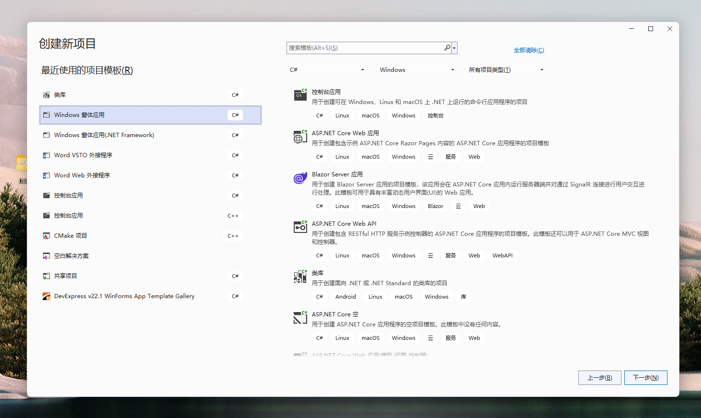
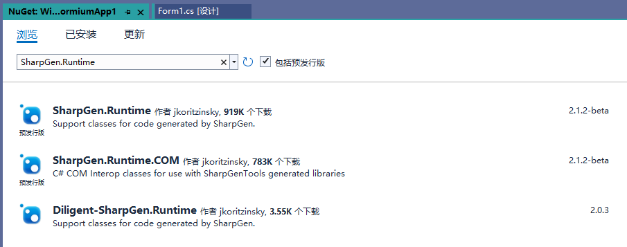

# 创建应用

本文将介绍如何创建一个简单的 WinFormium 应用程序，同时也展示了开发一个 WinFormium 应用程序的最小配置。

## 开发环境

- Visual Studio 2017 及以上版本 (推荐使用 Visual Studio 2022)
- .NET 6.0 SDK 及以上版本或 .NET Framework 4.6.2 及以上版本

## 创建项目

**1. 创建 WinForm 项目**
使用默认模板创建一个 WinForm 应用程序项目。根据项目的需求，请自行选择基于 .NET Framework 或 .NET Core 的 WinForm 项目模板。以下示例将使用基于 .NET 6.0 的 WinForm 项目进行演示。



**2. 通过 NuGet 安装 WinFormium [^1] 和 WinFormium Runtime 包**

使用 NuGet 包管理器或使用 NuGet 包管理器控制台运行以下命令来安装 WinFormium 包：

[^1]: WinFormium 分为社区版和企业版，社区版沿用 NanUI 项目的名称，企业版使用 WinFormium 项目的名称。社区版和企业版的 NuGet 包名称不同，如果您使用的是社区版，请安装 NetDimension.NanUI 包。示例使用社区版。

```powershell
PM> Install-Package NetDimension.NanUI
```

安装 WinFormium 所依赖的 Chromium Embedded Framework 运行库：

```powershell
PM> Install-Package NetDimension.NanUI.Runtime
```

需要注意，CEF 运行库巨大，再加上众所周知的原因，中国内地玩家请设置以下任意 NuGet 源。

- **Azure CDN** - https://nuget.cdn.azure.cn/v3/index.json
- **华为云** - https://repo.huaweicloud.com/repository/nuget/v3/index.json

另外，如果您的项目基于 .NET Framework，那么在安装 WinFormium 时包管理器可能会提示无法找到依赖项的错误，那么您需要手动安装两个依赖项。需要注意的是，这两个依赖项是预览状态，因此在搜索前需要在包管理器勾选“包括预发行版”复选框。



`SharpGen.Runtime` 依赖项：

```powershell
PM> Install-Package SharpGen.Runtime -Version 2.1.2-beta
```

`SharpGen.Runtime.COM` 依赖项：

```powershell
PM> Install-Package SharpGen.Runtime.COM -Version 2.1.2-beta
```

**3. 修改项目文件**

删除模板中预置的 `Form1.cs` 文件以及相关的资源文件。然后按如下示例修改 `Program.cs` 文件代码。

在以下示例代码中，WinFormiumApp 是 WinFormium 框架的入口类，它提供了一系列的静态方法用于配置 WinFormium 应用程序。在这里，我们使用 `CreateBuilder` 方法创建一个 WinFormium 应用程序的构建器，然后使用 `UseWinFormiumApp` 方法将该构建器与我们自己的应用程序类 `MyApp` 关联起来。最后使用 `Build` 方法创建一个 WinFormium 应用程序实例并运行。

```csharp
using WinFormium;

class Program
{
    [STAThread]
    static void Main(string[] args)
    {
        var builder = WinFormiumApp.CreateBuilder();

        builder.UseWinFormiumApp<MyApp>();

        var app = builder.Build();

        app.Run();
    }
}
```

创建 `MyApp.cs` 类文件并继承自 `WinFormiumStartup` 基类，该类主要是用来配置 WinFormium 应用程序的初始化信息。

在下面的示例代码中，MyAPP 继承了 WinFormiumStartup 类，并重写了其中的几个方法。其中 `UseMainWindow` 方法用于配置应用程序的主窗体，`WinFormiumMain` 方法用于配置应用程序的主进程中的代码，`ConfigurationChromiumEmbedded` 方法用于配置 Chromium Embedded Framework，`ConfigureServices` 方法用于配置应用程序的服务。在这里，我们使用 `UseMainFormium` 方法将应用程序的主窗体设置为 `MyWindow` 类，该类继承自 `Formium` 类，用于配置窗体的样式和主页地址。在后续的开发中，您可以在此类中添加其他的业务逻辑代码以实现更多功能。

```csharp
using WinFormium;

class MyAPP : WinFormiumStartup
{
    protected override MainWindowCreationAction? UseMainWindow(MainWindowOptions opts)
    {
        // 设置应用程序的主窗体
        return opts.UseMainFormium<MyWindow>();
    }

    protected override void WinFormiumMain(string[] args)
    {
        // Main函数中的代码应该在这里，该函数只在主进程中运行。这样可以防止子进程运行一些不正确的初始化代码。
        ApplicationConfiguration.Initialize();
    }

    protected override void ConfigurationChromiumEmbedded(ChromiumEnvironmentBuiler cef)
    {
        // 在此处配置 Chromium Embedded Framwork
    }

    protected override void ConfigureServices(IServiceCollection services)
    {
        // 在这里配置该应用程序的服务
    }
}
```

创建 WinFormium 窗体文件 `MyWindow.cs`， 该类实现 `Formium`，用于配置主窗体的样式和主页地址。在后续的开发中，您可以在此类中添加其他的业务逻辑代码以实现更多功能。

```csharp
using WinFormium;
using WinFormium.Forms;

class MyWindow : Formium
{
    public MyWindow()
    {
        // 设置主页地址
        Url = "https://cn.bing.com";
    }

    protected override FormStyle ConfigureWindowStyle(WindowStyleBuilder builder)
    {
        // 此处配置窗体的样式和属性，或不继承此方法以使用默认样式。

        var style = builder.UseSystemForm();

        style.TitleBar = false;

        style.DefaultAppTitle = "My first WinFomrim app";

        return style;
    }
}
```

## 运行项目

现在您已完成编码，编译并运行干刚才编写的应用程序，您将看到一个简单的窗体，该窗体将显示 Url 属性所指定的页面。


但您会发现，该窗体并没有显示原生 WinForm 窗体的标题栏和命令控制区域，虽然您可以拖动边框改变其尺寸，但是没有地方供您拖动令其移动位置，也没有最小化、最大化和关闭按钮。这是因为在上面配置窗体样式的代码 `style.TitleBar = false;` 使窗体移除了原生的标题栏，实现了无标题栏的窗体样式，因此您能控制整个窗体区域。在《窗体》的[《无标题栏窗体》](../窗体/无标题栏窗体.md)》中将介绍如何来控制这种类型的窗体。对于如何检测窗体的各项属性和状态，请参考[《窗体功能》](../窗体/窗体功能.md)。

## 另请参阅

- [窗体](../窗体/概述.md)
- [无标题栏窗体](../窗体/无标题栏窗体.md)
- [窗体 JavaScript 指南](../窗体/窗体JavaScript指南.md)
