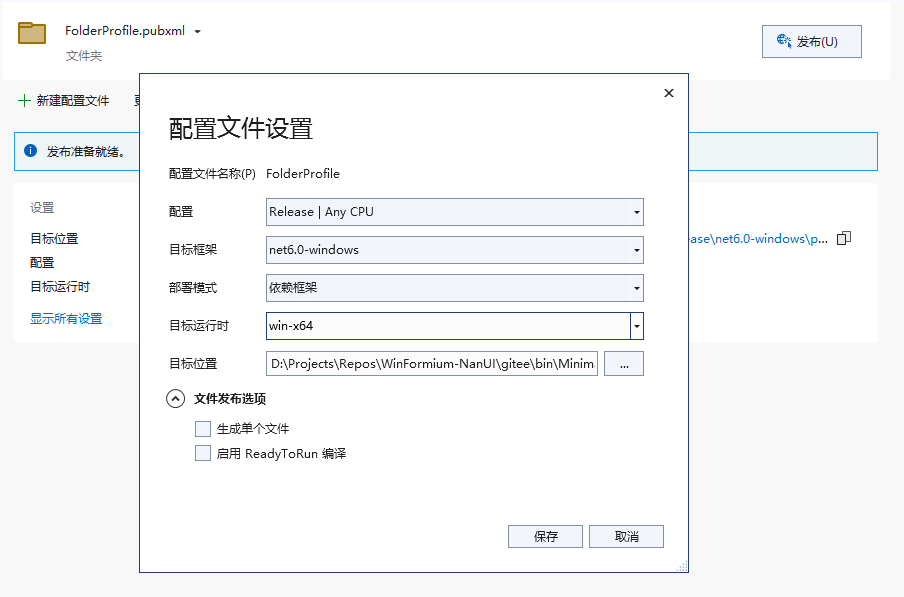

# 打包 WinFormium 应用程序

## 简介

当您的 WinFormium 应用程序开发完成后，如果需要对应用程序进行打包，那您应该去了解哪些文件应该打包到安装程序中。本文将介绍如何打包 WinFormium 应用程序。

在近期的 .NET 版本中采用了新的 SDK 样式，因此本文将分别对两种项目样式进行介绍。

## 传统样式项目

在传统样式项目中，当您使用 Release 配置编译项目后，您可以在项目的输出文件夹中找到编译输出的文件以及相关的依赖文件，这些文件就是您需要打包到安装程序中的文件。另外，您还需要将 CEF 运行时文件夹中的文件打包到安装程序中。

打包 CEF 运行时文件还需要考虑项目的平台架构，例如您的项目是基于 x86 平台的，那么您需要将 CEF 运行时文件夹中的 x86 文件夹打包到安装程序中，如果您的项目是基于 x64 平台的，那么您需要将 CEF 运行时文件夹中的 x64 文件夹打包到安装程序中。如果平台架构是 AnyCPU 时，需要将输出文件夹下的 fx 文件夹整个打包进安装程序中。

请按如下目录结构组织您的文件，并确保安装程序在安装时可以将这些文件按照相同的结构复制到安装目录中。

### AnyCPU 架构

[bin]
|- [Release]
|--- <YourApp.exe>
|--- <YourApp.exe.config>
|--- <Dependence1.dll>  
|--- ...
|--- <DependenceN.dll>
|--- [fx]
|----- <\*.\*>

### x86 架构和 x64 架构

`[bin]`
|- `[Release]`
|--- `[locales]`
|----- <\*.\*>
|--- <YourApp.exe>
|--- <YourApp.exe.config>
|--- <Dependence1.dll>  
|--- ...
|--- <DependenceN.dll>
|--- chrome_elf.dll
|--- d3dcompiler_47.dll
|--- icudtl.dat
|--- libcef.dll
|--- libEGL.dll
|--- libGLESv2.dll
|--- snapshot_blob.bin
|--- v8_context_snapshot.bin
|--- vk_swiftshader.dll
|--- vk_swiftshader_icd.json
|--- vulkan-1.dll
|--- chrome_100_percent.pak
|--- chrome_200_percent.pak
|--- resources.pak

x86 架构和 x64 架构的文件结构是一样的，请注意区分 libcef.dll 的架构。通常情况，您安装过 WinFormium 的 Runtime 包之后，在包目录下的 fx 文件夹结构就是 AnyCPU 架构所需要的文件结构。在 x86 和 x64 架构中，您可以从 fx 文件夹的 x86 或者 x64 文件夹中找到对应架构的 libcef.dll 文件及其依赖文件。

要想测试目录结构是否正确，您可以在规整好目录结构之后运行您的项目文件，如果项目能够正常运行，那么您的目录结构就是正确的，这个时候您就可以将这些文件通过任意安装程序制作工具打包到安装程序中了。

## SDK 样式项目

与传统项目样式相比，SDK 样式项目的打包工作就轻松许多，因为 Visual Studio 会自动帮您完成这些工作。只需要在项目文件上点击右键，选择“发布”，然后按照向导的提示进行操作即可。

需要注意的是，如果您的软件项目采用了主进程和子进程分开的形式，那么请确保子进程项目的可执行文件和依赖文件也被包含在发布文件夹中。在《配置应用》章节的[《使用子进程》](../配置应用/使用子进程.md)文档的“重新定位输出文件路径”一节中已经介绍过如何将子进程项目的输出文件复制到主进程项目的输出文件夹中，这样在发布项目时，子进程项目的输出文件也会被包含在发布文件夹中，如果这个操作没有被正确执行，请手动复制子进程项目的相关文件并按照上述文档中介绍的内容手动规整目录结构。

## 其他问题

需要您注意的是，目前 WinFormium 应用程序对“生成单个文件”的发布方式支持并不完善，如果您的应用程序采用了“生成单个文件”的发布方式，那么有可能会造成应用程序无法找到 CEF 运行时文件，所以在您发布项目时应当避免使用“生成单个文件”的发布方式。

## 另请参阅

- [使用子进程](../配置应用/使用子进程.md)
