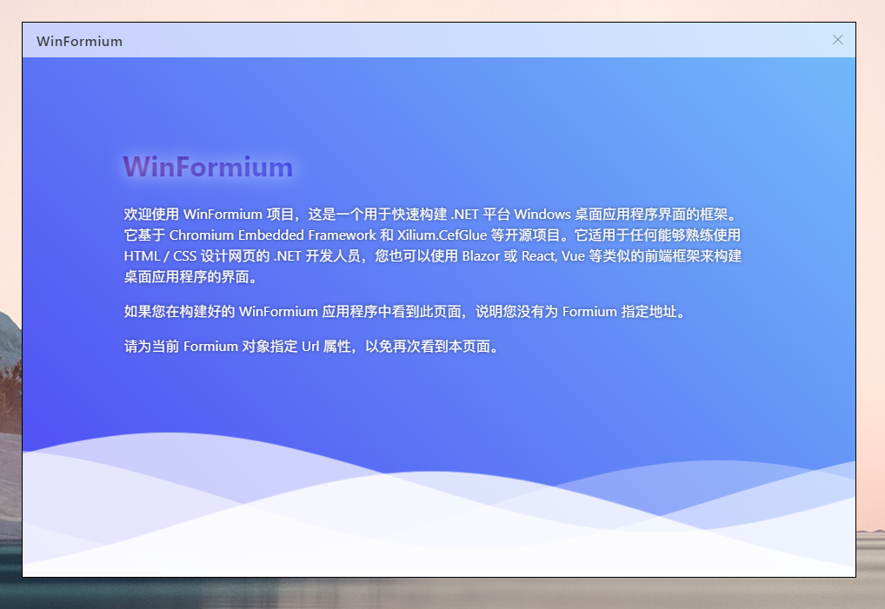
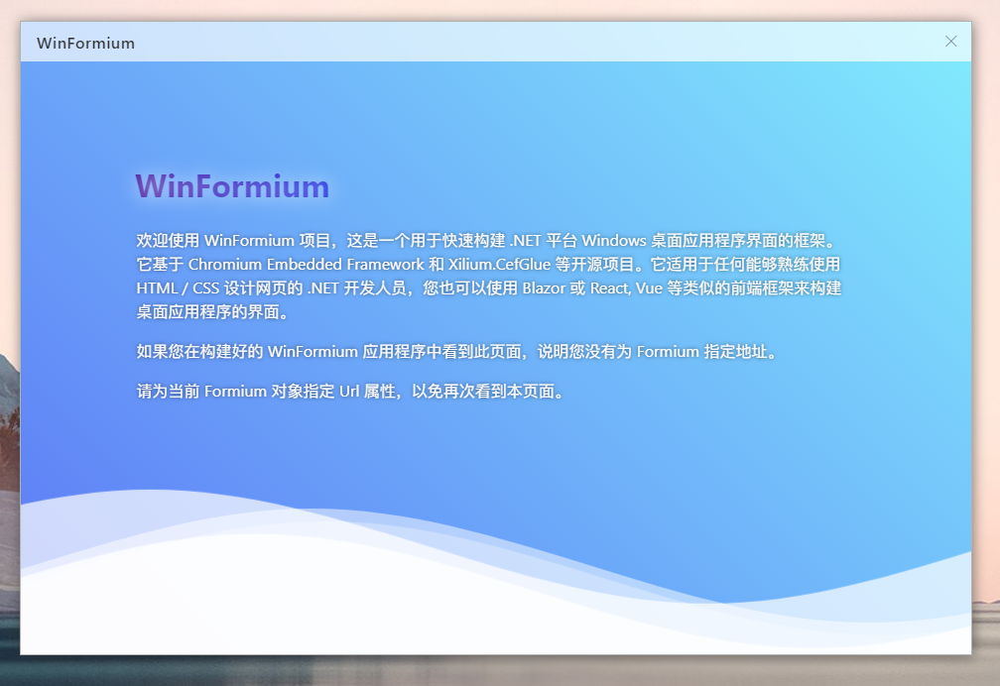
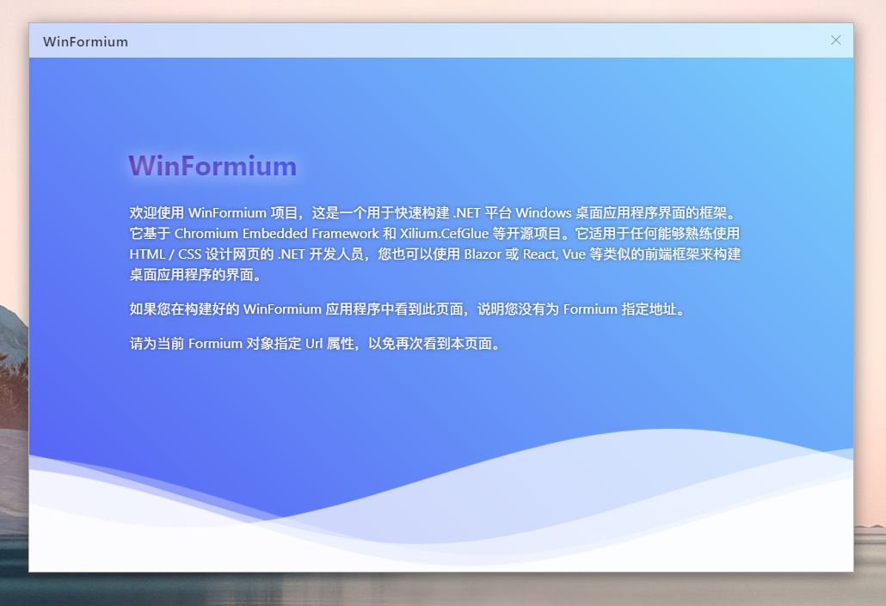
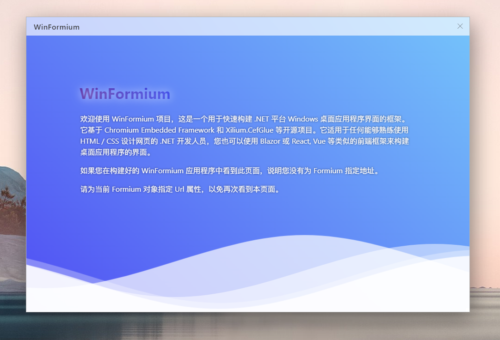

# 无边框窗体样式[^1]

[^1]: 无边框窗体样式仅支持 WinFormium 商业版

## 概述

WinFormium 无边框窗体没有边框，没有标题栏，没有最大化、最小化、关闭按钮，您可以使用整个窗体区域来显示网页内容。但与在 WinForm 中设置 `FormBorderStyle` 为 `None` 不同，WinFormium 的无边框窗体仍然可以拖动、调整大小、最大化、最小化、关闭，但这些功能需要您在设计窗体网页前端时进行设置。您可以参考[《无标题栏窗体》](./无标题栏窗体.md)来了解如何在通过网页前端实现这些功能。

除此之外，设置无边框窗体样式后窗体还拥有一个 WinFormium 内置的投影效果，该效果可以在您的窗体周围显示一个投影，这个投影并不是通过 DWM 生成的，所以它不受 Windows 窗口管理器的影响，即使应用程序运行在 Windows 8/8.1 系统上，也可以为窗体显示投影。同时，您可以设置无边框窗体投影的颜色和透明度，以及投影的大小和偏移量。

使用 `WindowStyleBuilder` 的扩展方法 `UseBorderlessForm` 来启用无边框窗体样式，该方法的返回值是 `BorderlessFormStyle` 类型，该类型继承自 `FormStyle` 类，因此您可以使用 `FormStyle` 类的属性来设置窗体的基础样式，并使用 `BorderlessFormStyle` 类的属性来设置无边框窗体样式特有的样式属性。

```csharp
protected override FormStyle ConfigureWindowStyle(WindowStyleBuilder builder)
{
    var style = builder.UseBorderlessForm();
    return style
}
```

## 设置窗体边线

设置 `ShowBorder` 属性为 `true` 时，窗体将显示边框，边框的颜色由 `BorderColor` 属性决定。默认情况下，不显示边框线条。

```csharp
protected override FormStyle ConfigureWindowStyle(WindowStyleBuilder builder)
{
    var style = builder.UseBorderlessForm();
    style.ShowBorder = true;
    style.BorderColor = Color.Gray;
    return style;
}
```

除了 `BorderColor` 属性之外，`BorderlessFormStyle` 还有一个 `InactiveBorderColor` 属性用于设置窗体失去焦点时的边框颜色。您可以把 `InactiveBorderColor` 属性设置为 `Color.Transparent`，WinFormium 将自动计算出一个合适的颜色作为窗体失去焦点时的边框颜色。这也是 `InactiveBorderColor` 的默认值。

## 设置投影

您可以设置 `WindowShadowEffect` 属性来控制无边框窗体的投影效果，该属性的值是一个 `ShadowEffect` 类型的枚举值，该枚举值包含了以下几种投影效果：

- `None` - 不显示投影
  
- `Glow` - 微微泛光
  
- `Small` - 比微微泛光多一点
  
- `Normal` - 正常投影，效果接近 DWM 生成的投影
  
- `Big` - 大一点的投影
  
- `Huge` - 很大的投影
  
- `DropShadow` - 投影
  

如果对默认的投影效果不满意，您可以使用 `ShadowColor` 属性来设置投影的颜色，使用 `InactiveShadowColor` 属性来设置窗体失去焦点时的投影颜色。您可以把 `InactiveShadowColor` 属性设置为 `Color.Transparent`，WinFormium 将自动计算出一个合适的颜色作为窗体失去焦点时的投影颜色。这也是 `InactiveShadowColor` 的默认值。

```csharp
protected override FormStyle ConfigureWindowStyle(WindowStyleBuilder builder)
{
    var style = builder.UseBorderlessForm();
    style.ShowBorder = true;
    style.BorderColor = Color.Gray;
    style.WindowShadowEffect = ShadowEffect.Normal;
    style.ShadowColor = Color.FromArgb(0x33, 0x33, 0x33);
    style.InactiveShadowColor = Color.FromArgb(0x66, 0x66, 0x66);
    return style;
}
```

## 另请参阅

- [窗体](./概述.md)
- [窗体功能](./窗体功能.md)
- [无标题栏窗体](./无标题栏窗体.md)
