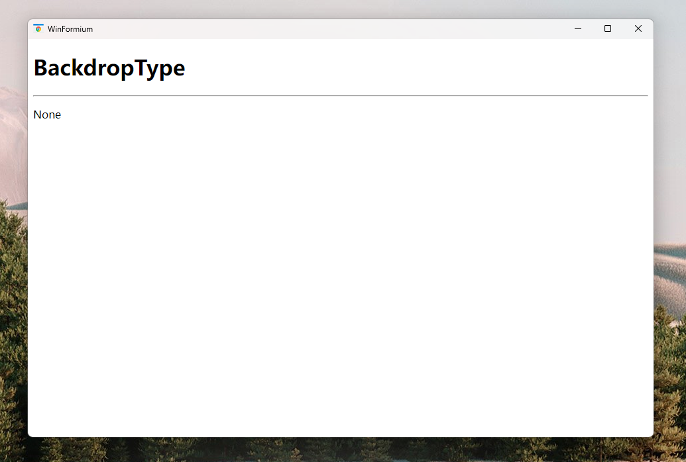
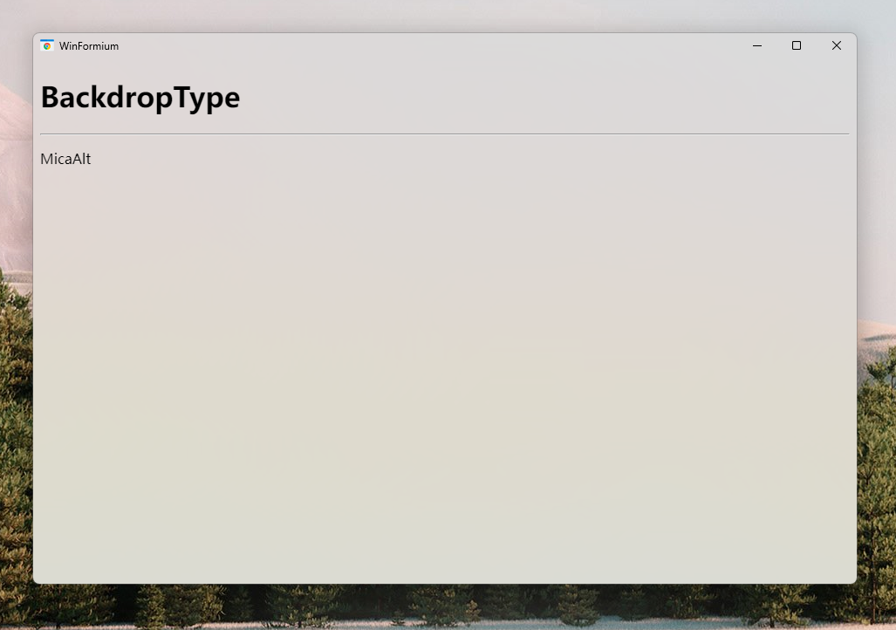
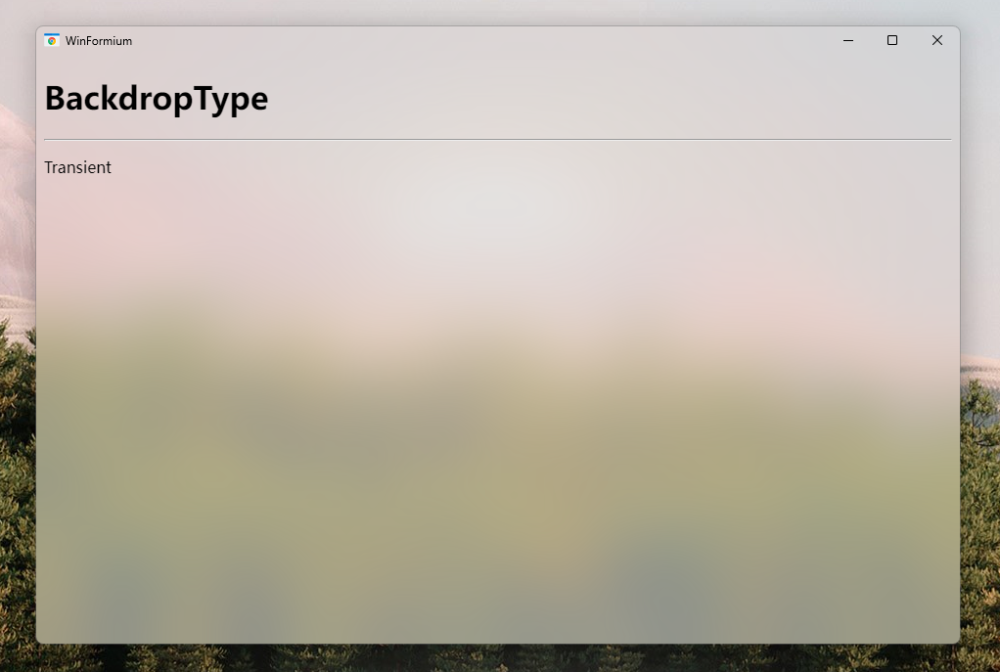

# 系统窗体样式

## 概述

系统窗体样式是 Formium 窗体的默认样式，它有两种形式，一种与 Windows Form 窗体的样式一致，包括标题栏、最大化、最小化、关闭按钮。另一种是移除了系统默认的标题栏和命令按钮区域，但保留系统边框。这两种样式通过属性 `TitleBar` 来控制。

使用 `WindowStyleBuilder` 的扩展方法 `UseSystemForm` 来启用系统窗体样式，该方法的返回值是 `SystemFormStyle` 类型，该类型继承自 `FormStyle` 类，因此您可以使用 `FormStyle` 类的属性来设置窗体的基础样式，并使用 `SystemFormStyle` 类的属性来设置系统窗体样式特有的样式属性。

```csharp
protected override FormStyle ConfigureWindowStyle(WindowStyleBuilder builder)
{
    var style = builder.UseSystemForm();
    return style
}
```

系统窗体样式的另一个属性 `BackdropType` 用于设置窗体背景的渲染类型。默认情况下 CEF 作为独立的子窗体嵌入到 Formium 的 Windows Form 区域，但在 Windows 系统提供了多种窗体背景材质，如果使用子窗体的方式放置浏览器，那么浏览器会覆盖这些材质特效，如果要启用这些材质特性，则需要使用 CEF 的离屏渲染功能，将网页在内存中渲染成带 alpha 通道的位图，再由 WinFormium 将图片渲染到窗体背景上，从而实现窗体背景与网页内容的混合渲染。`BackdropType` 属性用于设置窗体的渲染类型。

下面的文章将详细介绍这两个系统窗体样式的特有属性。

## TitleBar 属性

**保留标题栏和命令控制区域的系统窗体样式**

```csharp
protected override FormStyle ConfigureWindowStyle(WindowStyleBuilder builder)
{
    var style = builder.UseSystemForm();
    style.TitleBar = true;
    return style
}
```

**移除标题栏和命令控制区域的系统窗体样式**

```csharp
protected override FormStyle ConfigureWindowStyle(WindowStyleBuilder builder)
{
    var style = builder.UseSystemForm();
    style.TitleBar = false;
    return style
}
```

以下图片示例分别展示了系统窗体样式在开启标题栏和关闭标题栏两种不同属性之间的区别。


至于如何控制无标题栏窗体的大小和位置，请参考[《无标题栏窗体》](./无标题栏窗体.md)。

## BackdropType 属性[^*]

[^*]: BackdropType 属性仅支持 WinFormium 商业版

`BackdropType` 属性用于设置窗体的渲染类型，不同属性所受操作系统的支持不同，如果没有特别指出的，最低支持 Windows 7 service pack 1 系统。目前 `BackdropType` 属性支持以下几种类型：

- `None`
  不使用窗体背景渲染效果。这是 `BackdropType` 的默认值，设置此属性值时窗体不会开启 CEF 的离屏渲染功能，页面内容使用 CEF 默认的渲染方式进行渲染。
  

- `Surface`
  使用 Direct2D 渲染窗体背景。设置此属性值时窗体会开启 CEF 的离屏渲染功能，页面内容使用 Direct2D 渲染。
  

- `Transparent`
  使用 DirectComposition 渲染窗体背景，并且窗体背景透明。设置此属性值时窗体会开启 CEF 的离屏渲染功能，由于页面内容使用 DirectComposition 渲染，所以窗体背景透明，您在设计网页前端时可以利用窗体透明的特性来实现透明或半透明的界面特效。
  该特性需要 Windows 8 及以上版本支持。
  

- `Acrylic`
  使用 DirectComposition 渲染窗体背景，并且窗体背景模糊。设置此属性值时窗体会开启 CEF 的离屏渲染功能，并且窗体的背景会与桌面背景进行模糊混合，实现高斯模糊的桌面混合效果。
  该特性需要 Windows 10 版本 1809 及以上版本支持。
  

- `Mica`
  使用 DirectComposition 渲染窗体背景，并且窗体背景使用 Win 11 特有的 Mica （云母） 材质效果。设置此属性值时窗体会开启 CEF 的离屏渲染功能。
  该特性需要 Windows 11 版本 22000 及以上版本支持。
  
- `MicaAlt`
  使用 DirectComposition 渲染窗体背景，并且窗体背景使用 Win 11 特有的 MicaAlt （改色云母） 材质效果。设置此属性值时窗体会开启 CEF 的离屏渲染功能。
  该特性需要 Windows 11 版本 21H2 及以上版本支持。
  

- `Transient`
  使用 DirectComposition 渲染窗体背景，并且窗体背景使用 Win 11 特有的 Transient （亚克力） 材质效果。设置此属性值时窗体会开启 CEF 的离屏渲染功能。
  该特性需要 Windows 11 版本 21H2 及以上版本支持。
  

## 另请参阅

- [窗体](./概述.md)
- [窗体功能](./窗体功能.md)
- [无标题栏窗体](./无标题栏窗体.md)
