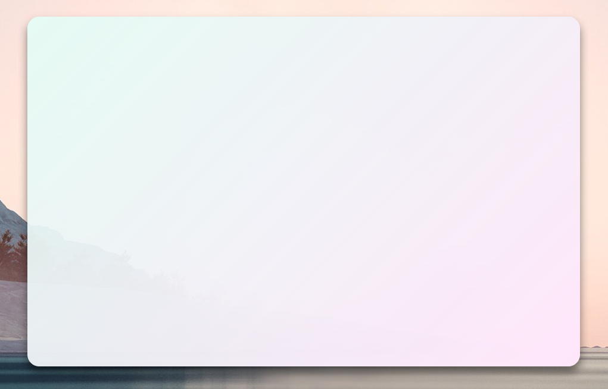

# 透明窗体样式[^1]

[^1]: 透明窗体样式仅支持 WinFormium 商业版

## 概述

透明窗体样式是指整个窗体可以是透明的，这样根据前端设计的不同还可以实现窗体的不规则形状。透明窗体样式需要开启 CEF 的离屏渲染模式，CEF 将渲染后的位图与当前窗体进行合成，这样就可以实现窗体的透明效果。

使用 `WindowStyleBuilder` 的扩展方法 `UseTransparencyForm` 可以设置窗体为透明窗体样式，示例代码如下：

```csharp
protected override FormStyle ConfigureWindowStyle(WindowStyleBuilder builder)
{
    var style = builder.UseTransparencyForm();
    return style
}
```

## RenderType 属性

透明窗体样式提供了三种渲染模式，您可以通过 `RenderType` 属性来设置渲染模式，属性值如下：

| 属性值            | 描述                                                            |
| ----------------- | --------------------------------------------------------------- |
| Skia              | 使用 SkiaSharp 进行位图渲染，并使用 LayerdWindow 实现透明窗体。 |
| Direct2D          | 使用 Direct2D 进行位图渲染，并使用 LayerdWindow 实现透明窗体。  |
| DirectComposition | 使用 DirectComposition 进行位图渲染及透明窗体。                 |

三种渲染模式的性能从高到低依次为：DirectComposition > Direct2D > Skia，但是 DirectComposition 需要 Windows 8 或更高版本的系统才能使用，如果您的应用程序需要兼容 Windows 7 系统，那么请使用其他两种渲染模式。`RenderType` 属性的默认值为 `RenderType.Skia`。

## ExcludeBorderArea 属性

`ExcludeBorderArea` 属性用于设置窗体边框的排除区域，排除区域内的区域将不会响应鼠标的 HitTest 事件，从下面的示例图片中您就能简单理解其用途。`ExcludeBorderArea` 属性的值为 `Padding` 类型，您可以使用 `Padding` 类型的属性来设置排除区域的大小，示例代码如下：

**C#**

```csharp
protected override FormStyle ConfigureWindowStyle(WindowStyleBuilder builder)
{
    var style = builder.UseTransparencyForm();
    style.ExcludeBorderArea = new Padding(15, 25, 15, 25);
    return style
}
```

**CSS**

```css
body{
  background-color: transparent;
  padding: 25px 15px 25px 15px;
}

...
```

`ExcludeBorderArea` 属性的值与前端的设计息息相关，您可以根据前端的设计来设置排除区域的大小。下面的图片是一个简单的示例，在前端页面的 css 中，使用 body 元素的 `padding` 属性把 div 元素阴影效果的区域排除在窗体边框之外，而在设置 div 元素的投影属性时，根据投影的偏移量和模糊半径来计算出 `padding` 属性的值，以确保排除区域能够容纳整个投影效果。

在前端设置好排除区域后，您还需要在 C# 代码中设置 `ExcludeBorderArea` 属性的值，这个值与前端容器的 `padding` 值相同，这样就确保了在此区域内鼠标不会响应 HitTest 事件。排除此区域后 WinFormium 会自动计算正确的可操作窗体尺寸大小。



如上图所示，排除区域的大小为 25px 15px 25px 15px，这个值与前端容器的 `padding` 值相同，所以鼠标位于投影部分时，将不会触发 HitTest 事件，当鼠标接近此 `padding` 值得边缘时，鼠标会自动变成可调整窗体大小的鼠标样式。

## 关于透明窗体样式的注意事项

在使用透明窗体样式时，尽管提供了实时更改窗体大小的接口（这个功能在以往的 NanUI 版本中并不支持），但是由于使用了离屏渲染模式，所以在调整窗体大小时会有一定的卡顿，这是由于 CEF 需要重新渲染位图并与窗体进行合成导致的，这个问题在 CEF 本身解决之前是无法避免的。所以建议您尽量避免使用可改变窗体尺寸的透明窗体样式。

要关闭透明窗体样式的可改变窗体尺寸功能，您可以设置 `Resizable` 属性为 `false`，这样用户就无法拖动窗体边框来改变窗体尺寸了。

```csharp
protected override FormStyle ConfigureWindowStyle(WindowStyleBuilder builder)
{
    var style = builder.UseTransparencyForm();
    style.Resizable = false;
    return style
}
```

## 另请参阅

- [窗体](./概述.md)
- [窗体功能](./窗体功能.md)
- [无标题栏窗体](./无标题栏窗体.md)
