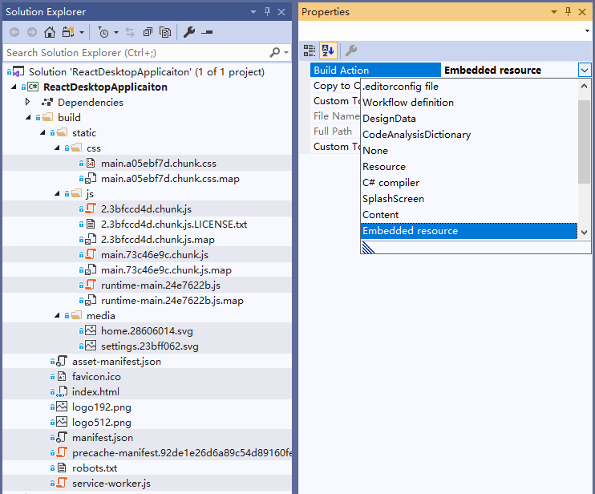

# 嵌入式文件资源

## 概述

嵌入式文件资源是指将文件资源嵌入到程序集中，这样做的好处是可以将前端的文件资源打包到任意程序集中，方便分发和使用。WinFormium 使用嵌入式文件资源控制器来管理嵌入式文件资源，您可以在同一个程序集中打包多个嵌入式文件资源控制器，为它们指定不同的 Url 即可。

## 嵌入资源

首先，您需要将包含前端资源的文件夹通过解决方案管理器拷贝到 WinFormium 应用程序的项目中，并为这些文件夹准备合适的名称。例如，使用 `Create-React-App` 创建的 React 项目，那么您可以将 `build` 目录拷贝到 WinFormium 应用程序的项目中。如果是使用 `Vue CLI` 创建的 Vue 项目，那么您可以将 `dist` 目录拷贝到 WinFormium 应用程序的项目中。

第二步，您需要从该目录中删除非必要的文件以减小程序集的大小，例如 `map` 文件、`manifest` 文件等。当然您还可以通过修改前端项目 `package.json` 文件中的打包脚本来避免生成这些文件，具体操作请自行查阅相关文档。

接下来，您需要将这些文件夹中的文件嵌入到程序集中。在 Visual Studio 中，在这些资源文件上点右键，选择“属性”，在“生成操作”中选择“嵌入的资源”。这样，这些文件夹中的文件就会被嵌入到程序集中了。

如果您的项目是 .NET Framework 类型的项目，且没有启用 SDK 样式的项目文件格式，那么您需要选择每一个需要嵌入的文件（您可以按住 Ctrl 再点击文件实现多选）并在属性窗口的“生成操作”中选择“嵌入的资源”。



如果您的项目是 SDK 样式的项目文件格式，那么您可以双击项目文件并在项目文件中添加以下代码来指定需要嵌入的文件：

```xml
<ItemGroup>
    <EmbeddedResource Include="build\**\*" />
</ItemGroup>
```

## 注册嵌入式文件资源控制器

您可以在 WinFormium 应用程序创建阶段使用 `AppBuilder` 来注册嵌入式文件资源控制器，也可以在 WinFormium 应用程序配置阶段使用 `WinFormiumStartup` 类的 `ConfigureServices` 以配置服务的方式来注册嵌入式文件资源控制器。

### 注册示例

**AppBuilder**

```csharp
class Program
{
    [STAThread]
    static void Main(){
        var builder = WinFormiumApp.CreateBuilder();

        var app = builder
        //...
        .UseEmbeddedFileResource(new EmbeddedFileResourceOptions
        {
            Scheme = "http",
            DomainName = "embedded.app.local",
            ResourceAssembly = typeof(Program).Assembly,
            EmbeddedResourceDirectoryName = "build",
        })
        .build();

        app.Run();

    }
}
```

使用 `AppBuilder` 的扩展方法 `UseEmbeddedFileResource` 来注册嵌入式文件资源控制器，该方法接受一个 `EmbeddedFileResourceOptions` 类型的参数，您可以通过该参数来指定嵌入式文件资源控制器的 Url 地址、资源所在的程序集、资源所在的文件夹名称等。

**WinFormiumStartup**

```csharp
class MyApp : WinFormiumStartup
{
    //...

    public override void ConfigureServices(IServiceCollection services)
    {
        //...
        services.AddEmbeddedFileResource(new EmbeddedFileResourceOptions
        {
            Scheme = "http",
            DomainName = "embedded.app.local",
            ResourceAssembly = typeof(Program).Assembly,
            EmbeddedResourceDirectoryName = "build",
        });
        //...
    }

}
```

使用 `WinFormiumStartup` 的扩展方法 `AddEmbeddedFileResource` 来注册嵌入式文件资源控制器，该方法接受一个 `EmbeddedFileResourceOptions` 类型的参数，您可以通过该参数来指定嵌入式文件资源控制器的 Url 地址、资源所在的程序集、资源所在的文件夹名称等。

### EmbeddedFileResourceOptions

`EmbeddedFileResourceOptions` 类型的参数用于指定嵌入式文件资源控制器的 Url 地址、资源所在的程序集、资源所在的文件夹名称等。它包含以下属性：

| 属性名称                      | 类型     | 描述                                                                                                                                                                         |
| ----------------------------- | -------- | ---------------------------------------------------------------------------------------------------------------------------------------------------------------------------- |
| Scheme                        | string   | 嵌入式文件资源控制器的 Url 协议名称，例如 `http`、`https`、`file` 等。                                                                                                       |
| DomainName                    | string   | 嵌入式文件资源控制器的 Url 域名，例如 `embedded.app.local`。                                                                                                                 |
| ResourceAssembly              | Assembly | 嵌入式文件资源控制器所在的程序集。如果您的资源嵌入在当前程序集，您可以使用 `Assembly.GetEntryAssembly()` 或 `Assembly.GetExecutingAssembly()` 来获取当前包含有资源的程序集。 |
| EmbeddedResourceDirectoryName | string   | 嵌入式文件资源控制器所在的文件夹名称，例如您的资源处在项目目录的 `wwwroot\build` 文件夹中，那么此处就需要指定 `wwwroot\build`。                                              |
| DefaultNamespace              | string   | 嵌入式文件资源控制器所在的文件夹名称所在的命名空间。通常您不需要指定默认命名空间，只有在您的程序集默认命名空间于程序集名称不一致时才需要指定。                               |

## 使用嵌入式文件资源

当您注册了嵌入式文件资源控制器后，您就可以在 WinFormium 应用程序中使用这些资源了。例如，您注册了一个嵌入式文件资源控制器，它的 Url 地址为 `http://embedded.app.local`，那么您就可以在 WinFormium 应用程序中使用 `http://embedded.app.local` 来访问资源了。

## 另请参阅

- [概述](./概述.md)
- [本地文件资源](./本地文件资源.md)
- [数据资源](./数据资源.md)
- [代理映射资源](./代理映射资源.md)
