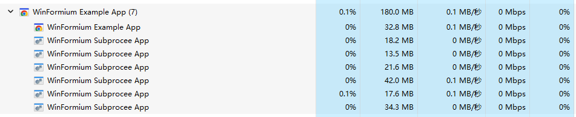

# The Subprocess

In the chapter about CEF multi-process architecture in [Overview](./Overview.md), we have briefly introduced why it is necessary to use an independent browser sub-process. This chapter will introduce in detail how to use an independent browser sub-process. .

## Create an independent browser sub-process project

**1. Create WinForm Project**

Create a WinForm application project using the default template. This project's .NET Framework type, version, and platform architecture need to be consistent with your main process project. For example, if your main process project is based on the x64 platform of .NET 6.0, then your independent browser sub-process project also needs to be based on the x64 platform of .NET 6.0.

**2. Install WinFormium package**

Use the NuGet Package Manager or run the following command using the NuGet Package Manager console to install the WinFormium package.

Browser subprocess projects do not require the WinFormium Runtime package to be installed.

```powershell
PM> Install-Package NetDimension.NanUI
```

**3. Modify project files**

Delete the `Form1.cs` file and related resource files preset in the template. Then modify the `Program.cs` file code as follows.

```csharp
using WinFormium;

class Program
{
     [STAThread]
     static void Main(string[] args)
     {
         ApplicationConfiguration.Initialize();

         var builder = WinFormiumApp.CreateBuilder();
         var app = builder.Build();
         app.RunAsSubprocess();
     }
}
```

In the above example code, you don't need to use the `UseWinFormiumApp` method, and the browser subprocess project does not need application configuration, since these configurations should only be done in the main process. Since the `UseWinFormiumApp` method is not used, you need to manually call the `ApplicationConfiguration.Initialize()` method to initialize the WinForm application. These initialization codes should only remain in the .NET Framework:

```csharp
Application.EnableVisualStyles();
Application.SetCompatibleTextRenderingDefault(false);
```

At the end of the sample code, use the `RunAsSubprocess` method to start the browser subprocess. This is different from the main process project, which uses the `Run` method to start the application and initialize the child process.

**4. Relocate the output file path**

You can manually copy the compiled output executable file and related dependency files to the output folder of the main process project, but doing so will result in the need to manually copy the files for each compilation, which is obviously inconvenient. Therefore, you can modify the project file to automatically copy the compiled output files to the output folder of the main process project to simplify this process.

Of course, you can also use the `ConfigureSubprocess` method in the `ConfigurationChromiumEmbedded` method of the `WinFormiumStarup` startup configuration class to configure the output file path of the subprocess, but doing so will cause the output file path of the subprocess to be different from the output file path of the main process. Inconsistency will cause the child process to be unable to find the dependent files of the main process, so this is not recommended.

```csharp
protected override void ConfigurationChromiumEmbedded(ChromiumEnvironmentBuiler cef)
{
     cef.ConfigureSubprocess(sub =>
     {
         sub.SubprocessFilePath = "<Path to subprocess>";
     });
}
```

**5. Compile and run**

After completing the above steps, you can compile and run the main process project. If everything goes well, you should see the executable file of one or more subprocess projects in the list of subprocesses of the main process in Task Manager.



As shown in the figure, `WinFormium Example App` is the main process, and `WinFormium Subprocess App` is the independent browser subprocess project created in this document.

## See also

- [Overview](./overview.md)
- [Startup Configuration](./Startup.md)
- [Application Manifest](./App-Manifest.md)
