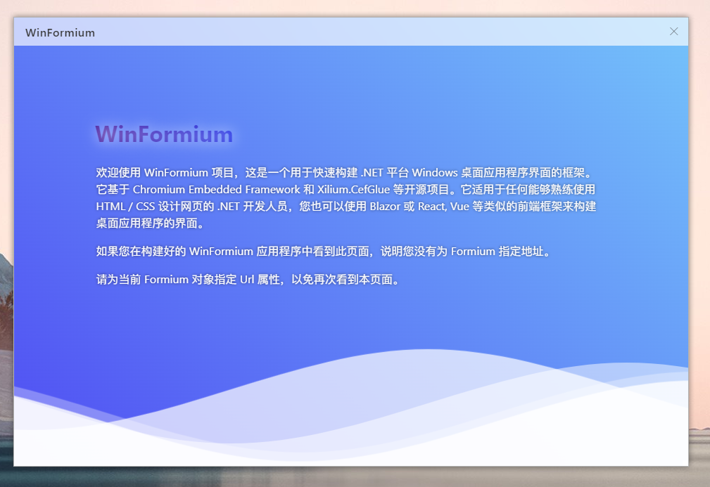
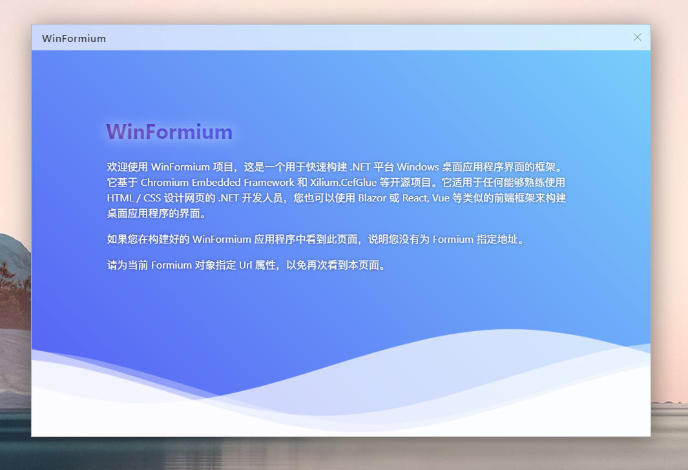

# Borderless Style Forms[^1]

[^1]: Borderless form style only supports WinFormium Business Edition

## Overview

WinFormium borderless forms have no borders, no title bars, and no maximize, minimize, or close buttons. You can use the entire form area to display web page content. But unlike setting `FormBorderStyle` to `None` in WinForm, WinFormium's borderless form can still be dragged, resized, maximized, minimized, and closed, but these functions require you to perform these functions when designing the form web front-end. set up. You can refer to [Forms without Titlebar](./Forms-Without-Titlebar.md) to learn how to implement these functions through the web front-end.

In addition, after setting the borderless form style, the form also has a built-in shadow effect in WinFormium, which can display a shadow around your form. This shadow is not generated by DWM, so it is not affected by Windows. The impact of the window manager, even if the application is running on a Windows 8/8.1 system, can display a shadow for the form. At the same time, you can set the color and transparency of the borderless form shadow, as well as the size and offset of the shadow.

Use the extension method `UseBorderlessForm` of `WindowStyleBuilder` to enable the borderless form style. The return value of this method is the `BorderlessFormStyle` type, which inherits from the `FormStyle` class, so you can use the properties of the `FormStyle` class to set it. The base style of the form, and use the properties of the `BorderlessFormStyle` class to set style properties specific to the borderless form style.

```csharp
protected override FormStyle ConfigureWindowStyle(WindowStyleBuilder builder)
{
     var style = builder.UseBorderlessForm();
     return style
}
```

## Borders

When the `ShowBorder` property is set to `true`, the form will display a border, and the color of the border is determined by the `BorderColor` property. By default, border lines are not displayed.

```csharp
protected override FormStyle ConfigureWindowStyle(WindowStyleBuilder builder)
{
     var style = builder.UseBorderlessForm();
     style.ShowBorder = true;
     style.BorderColor = Color.Gray;
     return style;
}
```

In addition to the `BorderColor` property, `BorderlessFormStyle` also has an `InactiveBorderColor` property that is used to set the border color when the form loses focus. You can set the `InactiveBorderColor` property to `Color.Transparent` and WinFormium will automatically calculate a suitable color as the border color when the form loses focus. This is also the default value of `InactiveBorderColor`.

## Drop Shadow

You can set the `WindowShadowEffect` property to control the shadow effect of borderless windows. The value of this property is an enumeration value of type `ShadowEffect`. This enumeration value includes the following shadow effects:

- `None` - do not show the shadow

  

- `Glow` – a slight glow

  

- `Small` - a little more than a slight bloom

  

- `Normal` - Normal projection, the effect is close to the projection generated by DWM

  

- `Big` - a larger shadow

  

- `Huge` - very large shadow

  

- `DropShadow` - drop shadow

  

If you are not satisfied with the default shadow effect, you can use the `ShadowColor` property to set the color of the shadow and the `InactiveShadowColor` property to set the color of the shadow when the form loses focus. You can set the `InactiveShadowColor` property to `Color.Transparent` and WinFormium will automatically calculate a suitable color as the shadow color when the form loses focus. This is also the default value of `InactiveShadowColor`.

```csharp
protected override FormStyle ConfigureWindowStyle(WindowStyleBuilder builder)
{
     var style = builder.UseBorderlessForm();
     style.ShowBorder = true;
     style.BorderColor = Color.Gray;
     style.WindowShadowEffect = ShadowEffect.Normal;
     style.ShadowColor = Color.FromArgb(0x33, 0x33, 0x33);
     style.InactiveShadowColor = Color.FromArgb(0x66, 0x66, 0x66);
     return style;
}
```

## See also

- [Forms](./overview.md)
- [Form Features](./Form-Features.md)
- [Forms without Titlebar](./Forms-Without-Titlebar.md)
