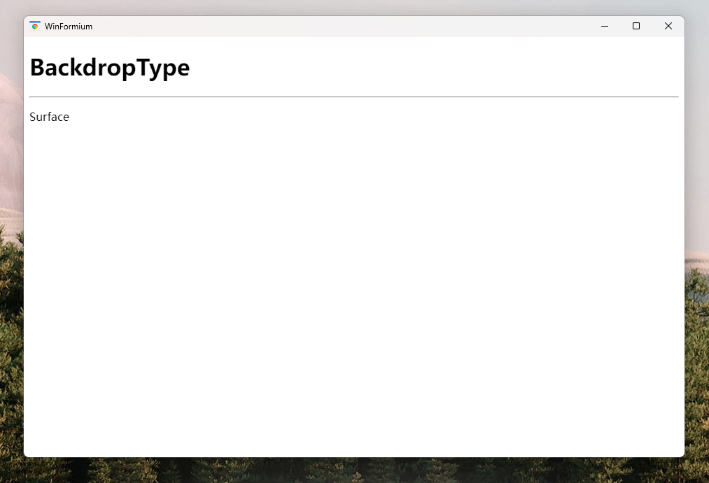
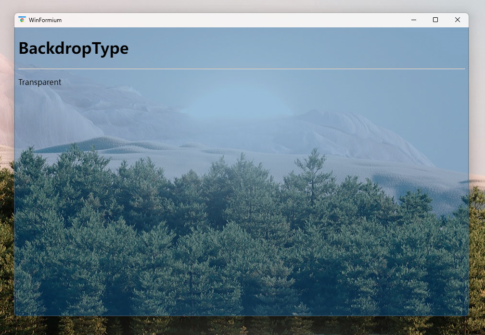
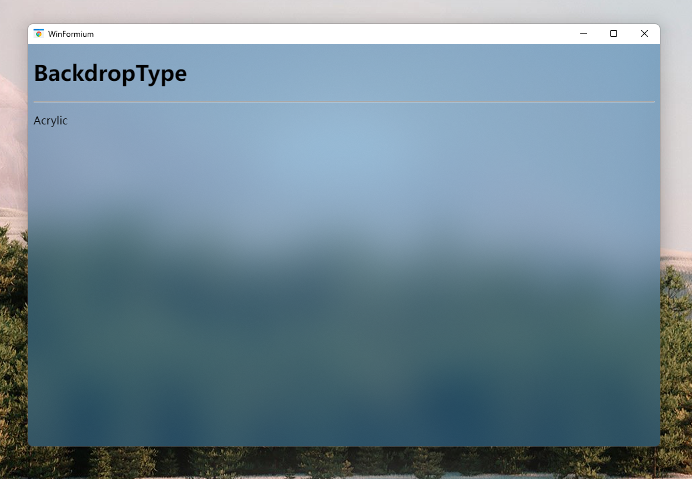
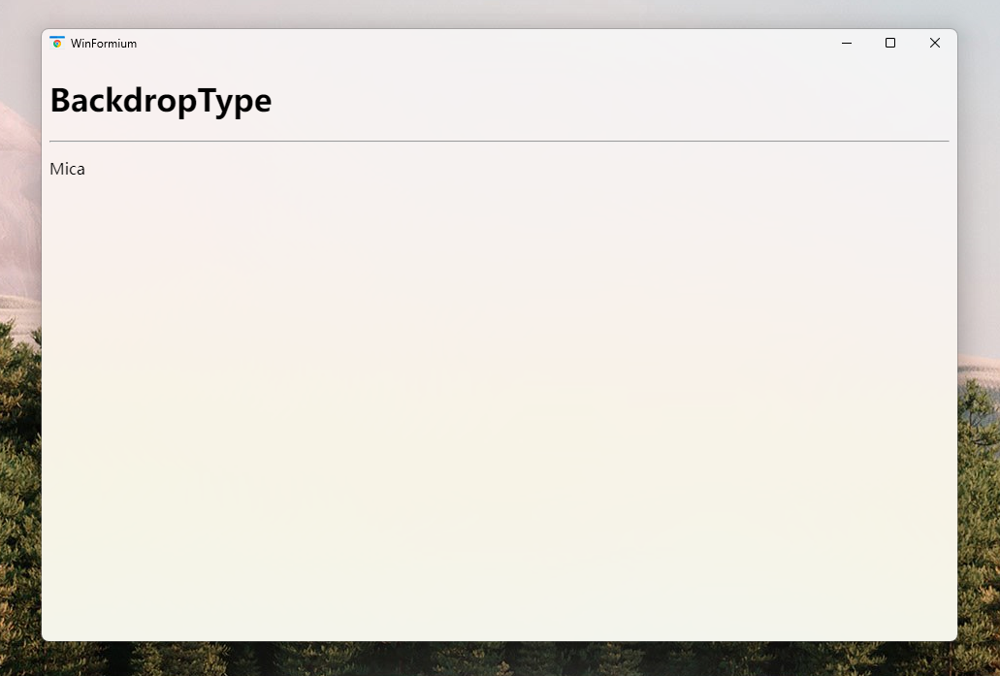

# System Style Forms

## Overview

The system form style is the default style of the Formium form. It has two forms. One is consistent with the style of the Windows Form form, including title bar, maximize, minimize, and close buttons. The other is to remove the system default title bar and command button area, but retain the system border. Both styles are controlled through the property `TitleBar`.

Use the extension method `UseSystemForm` of `WindowStyleBuilder` to enable the system form style. The return value of this method is the `SystemFormStyle` type, which inherits from the `FormStyle` class, so you can use the properties of the `FormStyle` class to set the window The base style of the form, and use the properties of the `SystemFormStyle` class to set the style properties specific to the system form style.

```csharp
protected override FormStyle ConfigureWindowStyle(WindowStyleBuilder builder)
{
     var style = builder.UseSystemForm();
     return style
}
```

Another property of the system form style, `BackdropType`, is used to set the rendering type of the form background. By default, CEF is embedded in the Windows Form area of Formium as an independent subform, but the Windows system provides a variety of form background materials. If the browser is placed using a subform, the browser will override these material effects. , if you want to enable these material features, you need to use CEF's off-screen rendering function to render the web page into a bitmap with alpha channel in the memory, and then WinFormium will render the image onto the form background, thereby realizing the form background and Hybrid rendering of web content. The `BackdropType` property is used to set the rendering type of the form.

The following articles will detail the unique properties of these two system form styles.

## TitleBar property

**Preserve system form styles for title bar and command control area**

```csharp
protected override FormStyle ConfigureWindowStyle(WindowStyleBuilder builder)
{
     var style = builder.UseSystemForm();
     style.TitleBar = true;
     return style
}
```

**Remove system form styles from title bar and command control area**

```csharp
protected override FormStyle ConfigureWindowStyle(WindowStyleBuilder builder)
{
     var style = builder.UseSystemForm();
     style.TitleBar = false;
     return style
}
```

The following picture examples show the difference between the two different attributes of the system form style, opening the title bar and closing the title bar.


As for how to control the size and position of an untitled bar form, please refer to [Forms without Titlebar](./Forms-Without-Titlebar.md).

## BackdropType attribute [^*]

[^*]: BackdropType attribute only supports WinFormium Business Edition

The `BackdropType` property is used to set the rendering type of the form. Different properties are supported by different operating systems. Unless otherwise specified, the minimum support is Windows 7 service pack 1 system. Currently the `BackdropType` property supports the following types:

- `None`
  Does not use form background rendering effects. This is the default value of `BackdropType`. When setting this property value, the form will not enable CEF's off-screen rendering function, and the page content will be rendered using CEF's default rendering method.

  

- `Surface`
  Render the form background using Direct2D. When setting this property value, the form will enable CEF's off-screen rendering function, and the page content will be rendered using Direct2D.

  

- `Transparent`
  Use DirectComposition to render the form background, and the form background is transparent. When this attribute value is set, the form will enable CEF's off-screen rendering function. Since the page content is rendered using DirectComposition, the background of the form is transparent. You can use the transparent feature of the form to achieve a transparent or translucent interface when designing the front end of a web page. special effects.
  This feature requires Windows 8 and above.

  

- `Acrylic`
  Use DirectComposition to render the form background, and the form background is blurred. When this property value is set, the form will enable CEF's off-screen rendering function, and the background of the form will be blurred and blended with the desktop background to achieve a Gaussian blurred desktop blending effect.
  This feature requires Windows 10 version 1809 and above.

  

- `Mica`
  Use DirectComposition to render the form background, and the form background uses the Win 11-specific Mica (mica) material effect. When setting this property value, the form will enable CEF's off-screen rendering function.
  This feature requires Windows 11 version 22000 and above.

  

- `MicaAlt`
  Use DirectComposition to render the form background, and the form background uses the Win 11-specific MicaAlt (color-changing mica) material effect. When setting this property value, the form will enable CEF's off-screen rendering function.
  This feature requires Windows 11 version 21H2 and above.

  

- `Transient`
  Use DirectComposition to render the form background, and the form background uses the Win 11-specific Transient (acrylic) material effect. When setting this property value, the form will enable CEF's off-screen rendering function.
  This feature requires Windows 11 version 21H2 and above.

  

## See also

- [Forms](./overview.md)
- [Form Features](./Form-Features.md)
- [Forms without Titlebar](./Forms-Without-Titlebar.md)
