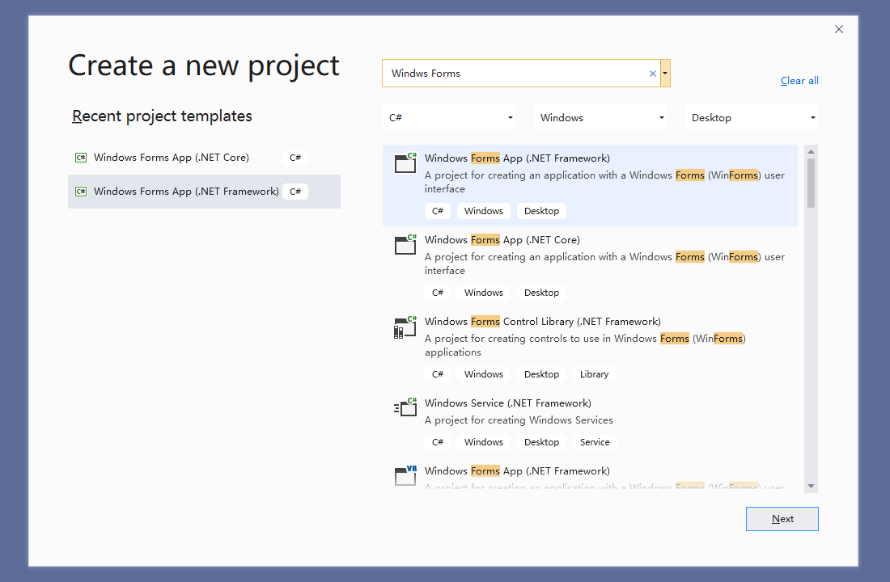
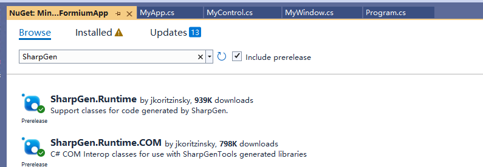

# Create An aApplication

This article describes how to create a simple WinFormium application and also shows the minimal configuration required to develop a WinFormium application.

## Environment

- Visual Studio 2017 and above (Visual Studio 2022 recommended)
- .NET 6.0 SDK and above or .NET Framework 4.6.2 and above

## Create project

**1. Create WinForm Project**
Create a WinForm application project using the default template. Depending on the needs of the project, please choose a WinForm project template based on .NET Framework or .NET. The following example will be demonstrated using a .NET 6.0 based WinForm project.



**2. Install WinFormium [^1] and WinFormium Runtime packages via NuGet**

Install the WinFormium package using NuGet Package Manager or run the following command using the NuGet Package Manager console:

[^1]: WinFormium is divided into community version and enterprise version. The community version uses the name of the NanUI project, and the enterprise version uses the name of the WinFormium project. The NuGet package names are different for Community Edition and Enterprise Edition. If you are using Community Edition, please install the NetDimension.NanUI package. The example uses the Community Edition.

```powershell
PM> Install-Package NetDimension.NanUI
```

Install the Chromium Embedded Framework runtime library that WinFormium depends on:

```powershell
PM> Install-Package NetDimension.NanUI.Runtime
```

In addition, if your project is based on .NET Framework, the package manager may prompt an error that the dependencies cannot be found when installing WinFormium, then you need to install the two dependencies manually. It should be noted that these two dependencies are in preview status, so you need to check the "Include pre-release versions" checkbox in the package manager before searching.



`SharpGen.Runtime` dependencies:

```powershell
PM> Install-Package SharpGen.Runtime -Version 2.1.2-beta
```

`SharpGen.Runtime.COM` dependencies:

```powershell
PM> Install-Package SharpGen.Runtime.COM -Version 2.1.2-beta
```

**3. Modify project files**

Delete the `Form1.cs` file and related resource files preset in the template. Then modify the `Program.cs` file code as follows.

In the following sample code, WinFormiumApp is the entry class of the WinFormium framework, which provides a series of static methods for configuring WinFormium applications. Here we create a builder for a WinFormium application using the `CreateBuilder` method and then associate the builder with our own application class `MyApp` using the `UseWinFormiumApp` method. Finally, use the `Build` method to create a WinFormium application instance and run it.

```csharp
using WinFormium;

class Program
{
     [STAThread]
     static void Main(string[] args)
     {
         var builder = WinFormiumApp.CreateBuilder();

         builder.UseWinFormiumApp<MyApp>();

         var app = builder.Build();

         app.Run();
     }
}
```

Create the `MyApp.cs` class file and inherit from the `WinFormiumStartup` base class. This class is mainly used to configure the initialization information of the WinFormium application.

In the following sample code, MyAPP inherits the WinFormiumStartup class and overrides several of its methods. The `UseMainWindow` method is used to configure the main form of the application, the `WinFormiumMain` method is used to configure the code in the application's main process, the `ConfigurationChromiumEmbedded` method is used to configure the Chromium Embedded Framework, and the `ConfigureServices` method is used to configure the application program services. Here, we use the `UseMainFormium` method to set the application's main form to the `MyWindow` class, which inherits from the `Formium` class to configure the form's style and homepage address. In subsequent development, you can add other business logic code to this class to achieve more functions.

```csharp
using WinFormium;

class MyAPP: WinFormiumStartup
{
     protected override MainWindowCreationAction? UseMainWindow(MainWindowOptions opts)
     {
         //Set the main form of the application
         return opts.UseMainFormium<MyWindow>();
     }

     protected override void WinFormiumMain(string[] args)
     {
         //The code in the Main function should be here, this function only runs in the main process. This prevents the child process from running some incorrect initialization code.
         ApplicationConfiguration.Initialize();
     }

     protected override void ConfigurationChromiumEmbedded(ChromiumEnvironmentBuiler cef)
     {
         // Configure Chromium Embedded Framwork here
     }

     protected override void ConfigureServices(IServiceCollection services)
     {
         // Configure the application's services here
     }
}
```

Create a WinFormium form file `MyWindow.cs`. This class implements `Formium` and is used to configure the style and home page address of the main form. In subsequent development, you can add other business logic code to this class to achieve more functions.

```csharp
using WinFormium;
using WinFormium.Forms;

class MyWindow : Formium
{
     publicMyWindow()
     {
         //Set homepage address
         Url = "https://cn.bing.com";
     }

     protected override FormStyle ConfigureWindowStyle(WindowStyleBuilder builder)
     {
         // Configure the style and properties of the form here, or do not inherit this method to use the default style.

         var style = builder.UseSystemForm();

         style.TitleBar = false;

         style.DefaultAppTitle = "My first WinFomrim app";

         return style;
     }
}
```

## Run the project

Now that you have finished coding, compiled, and run the application you just wrote, you will see a simple form that displays the page specified by the Url property.


But you will find that the form does not display the title bar and command control area of the native WinForm form. Although you can drag the border to change its size, there is no place for you to drag it to move it, and there is no minimize, Maximize and close buttons. This is because the code `style.TitleBar = false;` that configures the form style above causes the form to remove the native title bar and implement a form style without a title bar, so you can control the entire form area. In [Forms Without Titlebar](../Forms/Forms-without-Titlebar.md) will introduce how to control this type of form. For how to detect various properties and status of the form, please refer to [Form Features](../Form/Form-Features.md).

## See also

- [Getting Started](./Overview.md)
- [Forms](../Forms/Overview.md)
- [Forms Without Titlebar](../Forms/Forms-without-Titlebar.md)
- [Form JavaScript Guide](../Forms/Form-JavaScript-Guide.md)
