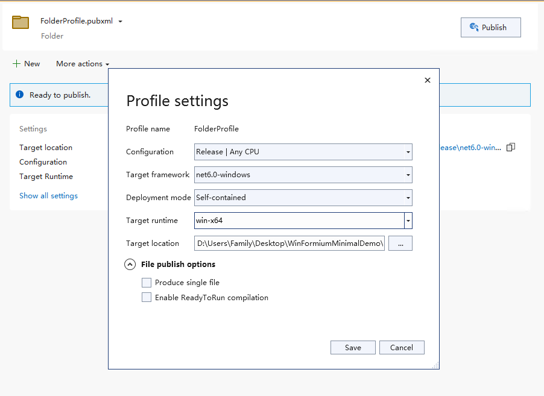

# Package the WinFormium application

## Introduction

After your WinFormium application is developed, if you need to package the application, you should understand which files should be packaged into the installer. This article describes how to package a WinFormium application.

New SDK styles have been adopted in recent .NET versions, so this article will introduce each of the two project styles.

## Traditional Projects

In a traditional .NET project, after you use the Release configuration to compile the project, you can find the compiled output files and related dependency files in the output folder of the project. These files are the files that you need to package into the installation program. Additionally, you need to package the files in the CEF runtime folder into the installer.

When packaging CEF runtime files, you also need to consider the platform architecture of the project. For example, if your project is based on the x86 platform, then you need to package the x86 folder in the CEF runtime folder into the installer. If your project is based on x64 platform, you need to package the x64 folder in the CEF runtime folder into the installer. If the platform architecture is AnyCPU, the entire fx folder under the output folder needs to be packaged into the installation program.

Please organize your files according to the following directory structure, and ensure that the installation program can copy these files to the installation directory in the same structure during installation.

### AnyCPU architecture

[bin]
|- [Release]
|--- <YourApp.exe>
|--- <YourApp.exe.config>
|--- <Dependence1.dll>
|--- ...
|--- <DependenceN.dll>
|--- [fx]
|----- <\*.\*>

### x86 architecture and x64 architecture

`[bin]`
|- `[Release]`
|--- `[locales]`
|----- <\*.\*>
|--- <YourApp.exe>
|--- <YourApp.exe.config>
|--- <Dependence1.dll>
|--- ...
|--- <DependenceN.dll>
|--- chrome_elf.dll
|--- d3dcompiler_47.dll
|---icudtl.dat
|--- libcef.dll
|--- libEGL.dll
|--- libGLESv2.dll
|--- snapshot_blob.bin
|--- v8_context_snapshot.bin
|--- vk_swiftshader.dll
|--- vk_swiftshader_icd.json
|--- vulkan-1.dll
|--- chrome_100_percent.pak
|--- chrome_200_percent.pak
|--- resources.pak

The file structures of x86 architecture and x64 architecture are the same. Please pay attention to distinguish the architecture of libcef.dll. Normally, after you install the Runtime package of WinFormium, the fx folder structure in the package directory is the file structure required by the AnyCPU architecture. In x86 and x64 architectures, you can find the libcef.dll file and its dependent files of the corresponding architecture from the x86 or x64 folder of the fx folder.

To test whether the directory structure is correct, you can run your project files after arranging the directory structure. If the project can run normally, then your directory structure is correct. At this time, you can create these files through any installation program. The tools are packaged into the installer.

## SDK Style Projects

Packaging SDK-style projects is much easier than traditional project styles because Visual Studio does it for you automatically. Just right-click on the project file, select "Publish", and then follow the wizard's prompts.

It should be noted that if your software project adopts the form of separate main process and sub-process, then please ensure that the executable file and dependent files of the sub-process project are also included in the release folder. In the "Relocating Output File Path" section of the [Subprocess](../Configuration/Subprocess.md) document in the "Configuring Application" chapter, we have already introduced how to change the output file of the subprocess project Copy to the output folder of the main process project, so that when publishing the project, the output files of the sub-process project will also be included in the publishing folder. If this operation is not performed correctly, please manually copy the relevant files of the sub-process project And manually organize the directory structure according to the content described in the above document.

## Tips

Please note that the current WinFormium application's support for the "generate a single file" publishing method is not perfect. If your application adopts the "generate a single file" publishing method, it may cause the application to be unable to find CEF. runtime files, so you should avoid using the "generate a single file" publishing method when publishing your project.

## See also

- [Getting Started](./Overview.md)
- [Subprocess](../Configuration/Subprocess.md)
