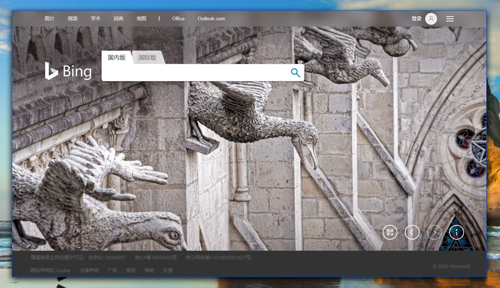

# NanUI Forms

[[Home](README.md)]

- [NanUI Forms](#nanui-forms)
  - [Initialize Formium](#initialize-formium)
  - [Set Form Properties](#set-form-properties)
  - [Set Browser Properties](#set-browser-properties)
  - [Form Styles](#form-styles)
  - [Use NanUI Built-in Commands](#use-nanui-built-in-commands)

**Formium** is named after `Form` in WinForms programming and ʻium`in`Chromium`. As the name implies, it is the combination of `WinForms`and`Chromium`, `Form`+ʻium`=`Formium`.

Formium wraps most of the forms of `System.Window.Forms.Form`, and combines with the CEF framework. The goal is to bring NanUI users the same development experience as WinForms.

## Initialize Formium

Create a class that inherits the abstract class `Formium` and implements the abstract properties `WindowType` and `StartUrl`.

```C#
using NetDimension.NanUI;
using NetDimension.NanUI.HostWindow;

class SimpleWindow : Formium
{
    public override HostWindowType WindowType { get; }
    public override string StartUrl { get; }
}

```

Use `WindowType` to set the window rendering style. As shown below, you can specify the form style as borderless.

```C#
public override HostWindowType WindowType => HostWindowType.Borderless;
```

Use `StartUrl` to specify the URL address of the browser's start page.

```C#
public override string StartUrl => "https://example.com";
```

## Set Form Properties

In WinForm development, you need to create child controls in the constructor, and set various properties for the child controls to draw the form and content (usually this work is done by a visual form designer). There is no such thing as a child control in NanUI's form Formium, because the work of drawing the interface is completely handed over to the browser, so you don't need to create child controls in the constructor, but you still need to set properties for the form itself. Only commonly used form properties, events and methods are disclosed in Formium. You cannot directly manipulate the original Form components. This design is to avoid all kinds of unnecessary problems caused by directly modifying the related contents of the Form.

In the constructor of Formium, you can use the original properties and methods of Form and the specific properties and methods of Formium. The properties and methods related to form settings in Formium can be found in the [Form Related Members](nanui-formium-winform-members.md) chapter for more information.

## Set Browser Properties

Overload the OnReady method in Formium, you can set the browser-related content in this method, including the basic properties of the browser and the processing of various events. For specific properties, methods and events, please refer to [Browser Related Members](nanui-formium-browser-members.md) for more information.

## Form Styles

Currently `WindowType` of `Formium` supports 5 specific styles: `System`, `Borderless`, `Kiosk`, `Layered` and ʻAcrylic`:

- **System**: System native window style.

  The system native form style is consistent with the traditional WinForm application interface, with the title bar, border and system command area of the system style, similar to that when dragging the WebBrowser control on the traditional Form control and setting the Dock property to Fill.

  

  To learn more about the system of the `System` window type, please refer to the [Using Native Style Window](using-system-style-window.md) chapter.

- **Borderless**: Borderless window style.

  In the borderless window style, the system's native title bar and border are hidden, and you can use the entire window area to draw your application interface. The Borderless mode provides a variety of window projection effects and color settings, as well as three border styles of `BorderLine`, `Rounded` and `None`.

  

  To learn more about the `Borderless` window type system, please refer to the [Using Borderless Style Window](using-borderless-style-window.md) chapter.

- **Kiosk**: Kiosk mode style.

  Kiosk style windows are commonly used in scenarios that require full-screen display of window content, such as: industrial control PC interface, query machine interface, large data screen, etc.
  To learn more about the `Kiosk` window type system, please refer to the [Using Kiosk Style Window](using-kiosk-style-window.md) chapter.

- **Layered**: Layered window style.

  Using Layered style allows you to create profiled, semi-transparent forms. It should be noted that the special-shaped window does not provide the option to change the size of the window in real time. According to the settings of the transparent or semi-transparent area in the web page, the special-shaped and semi-transparent effect can be achieved.

  

  To learn more about the `Layered` window type system, please refer to the [using-layered-style-window.md) chapter.

- **Acrylic**: Acrylic special effect window style.

  Acrylic special effects are a new feature provided after the Windows 10 Creators Update. It allows the transparent or translucent area of the form to be blurred and blended with desktop elements to achieve a special matte acrylic effect. Same as the Layered style, according to the settings of the transparent or semi-transparent area in the web page, a frosted glass effect with a specific effect will be achieved.

  

  To learn more about the ʻAcrylic` window type system, please refer to the [Using Win10 Acrylic Special Effects Style Window](using-acrylic-style-window.md) chapter.

## Use NanUI Built-in Commands

Formium has built-in the html attribute `formium-command` in the front-end environment and the `Formium` object in the JavaScript context.

**formium-command Property**

Maximize, minimize, restore and close commands that can be achieved when the user clicks on the HTML element with the `formium-command` attribute.

For example, setting formium-command="close" can close the form after clicking the element.

```html
<button formium-command="close">Close</button>
```

Currently, the following formium-command attribute values are provided:

| Name     | Operation            |
| :------- | :------------------- |
| maximize | Maximize window      |
| minimize | Minimize window      |
| restore  | Restore window       |
| close    | Close current window |

**Formium Object**

NanUI registers the `Formium` object in Chromium's Javascript environment. Through this object, you can get the relevant information of the current form, or use the built-in functions to change the status of the form.

- **Formium**

  - get _culture_ `string`

    Get the language setting of the current application. For example: `zh-CN`.

  - _onReady_ `(calllback:function) => void`

    When the DOM is loaded (excluding resources), the callback function `callback` is executed.

  - _onContextReady_ `(calllback:function) => void`

    When the Formium context is ready, the callback function `callback` is executed.

  - **hostWindow** `object`

    - _minimize_ `() => void`

      Minimize the form.

    - _maximize_ `() => void`

      Maximize the form.

    - _close_ `() => void`

      Close the current form.

    - _restore_ `() => void`

      Restore the current form.

    - _fullScreen_ `() => void`

      Make the current window full screen.

    - _moveTo_ `(x:int, y:int) => void`

      Move the current window to the position of the `x` and `y` coordinates on the screen.

    - _sizeTo_ `(width:int, height:int) => void`

      Change the size of the window to `width`\*`height`.

    - _getWindowState_ `() => string`

      Get the status of the current form. The return value is one of: `normal`, `minimized` and `maximized`.

    - _getWindowRectangle_ `() => {x:int, y:int, width:int, height:int}`

      Get the coordinates and size of the current window.

    - _active_ `() => void`

      Activate the current window.

  - **network** `object`

    - _isNetworkAvailable_ `() => bool`

      Test the current network connection status. It returns true when the network is available, otherwise it returns false.

  - **version** `object`

    - get _formium_ `string`

      Get the current version of NanUI.

    - get _chromium_ `string`

      Get the current Chromium version.

  - **external** `object`

    All objects registered through the `RegisterExternalObjectValue` method are included in this object collection. Use `Formium.external.XXX` to call your registered object and its contained properties and methods (where `XXX` is the name of the registered object).

**Custom events in the browser**

In addition to registering objects in Chromium's JavaScript environment, NanUI also registered some notification events that carry form changes. You can capture these events by registering event handlers to achieve various functions.

**hostactivated**

The form gets the focus and is activated.

**hostdeactivate**

The form loses focus.

**hostactivatestatechange**

Form focus state changed

Parameter

- _actived:`bool`_: active state [true: get focus|false: lose focus].

**hoststatechanged**

Maximize the window to minimize state changed

Parameter

-_state:`string`_: State name [normal|minimized|maximized].

**hostsizechanged**

The size of the form changed

Parameter

- _width:`int`_: width
- _height:`int`_: height

For example, we can add different styles to the form by capturing the event that carries the form to maximize and minimize the state change:

```javascript
window.addEventListener("hoststatechanged", (e) => {
  if (e.detail.state === "maximized") {
    console.log("窗口被最大化了");
  } else if (e.state === "minimized") {
    console.log("窗口被最小化了");
  } else {
    console.log("正常状态");
  }
});
```

**CSS properties representing the state of the form**

Formium will add some class names to the root tag html of the DOM in different states to facilitate setting effects for specific states when writing front-end page CSS. Currently includes the following special built-in class names:

- **formium-focus**

  When the current form is active, the html tag has a class name called `formium-focus`.

- **formium-blur**

  When the current form is in the background state, the html tag has a class name called `formium-blur`.

- **formium-maximized**

  When the current form is maximized, the html tag has a class name called `formium-maximized`.

For example, you need to specify different styles for a certain DOM element when the form is in active and inactive states:

**Html**

```html
<div class="my-div">Hello NanUI!</div>
```

**CSS**

```css
html.formium-focus .my-div {
  background-color: #red;
  color: white;
}

html.formium-blur .my-div {
  background-color: #gray;
  color: black;
}
```
