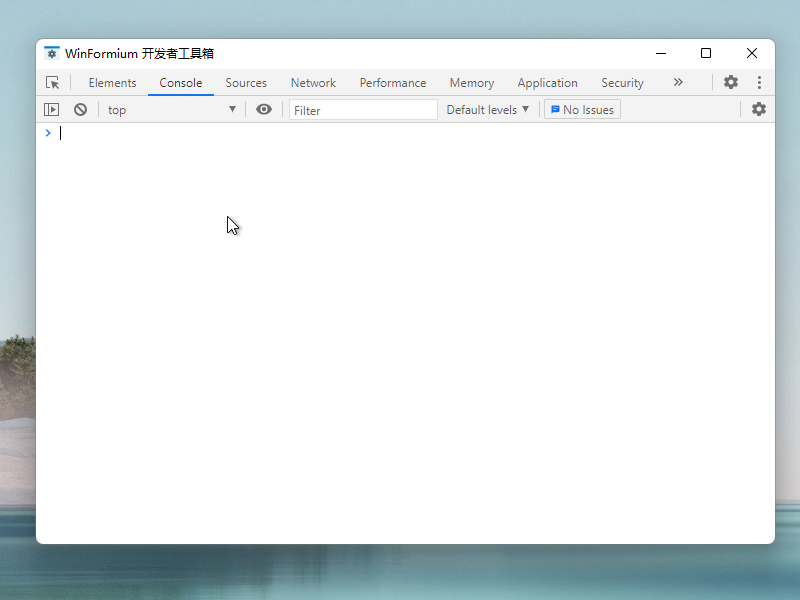

# Register JavaScript Object

[[Home](README.md)]

- [Register JavaScript Object](#register-javascript-object)
  - [Create Object](#create-object)
  - [Registered object](#registered-object)
  - [Result](#result)

In many cases, it is necessary to register .NET related objects in the JavaScript environment to extend the functionality of NanUI applications. NanUI provides this capability. Use `JavaScriptValue` to create objects and bind the mapping of .NET objects, and then use the `RegisterExternalObjectValue` method of the Formium form to register the objects created by `JavaScriptValue` to the `Formium.external` object of the JavaScript environment of the front-end page.

## Create Object

Using JavaScriptValue to create an object, you can add data types like `property`, `value`, `synchronous method`, and `asynchronous method` to JavaScriptValue object. Please see the following example for details.

```C#
var obj = JavaScriptValue.CreateObject();

//Register read-only attributes
obj.SetValue("now", JavaScriptValue.CreateProperty(() =>
{
    return JavaScriptValue.CreateDateTime(DateTime.Now);
}));

//Registration value
obj.SetValue("version", JavaScriptValue.CreateString(Assembly.GetExecutingAssembly().GetName().Version?.ToString()));

//Register readable and writable attributes
obj.SetValue("subtitle", JavaScriptValue.CreateProperty(() => JavaScriptValue.CreateString(Subtitle), title => Subtitle = title.GetString()));

//Register the synchronization method
obj.SetValue("messagebox", JavaScriptValue.CreateFunction(args =>
{
  var msg = args.FirstOrDefault(x => x.IsString);

  var text = msg?.GetString();

  InvokeIfRequired(() =>
  {
      MessageBox.Show(HostWindow, text, "Message from JS", MessageBoxButtons.OK, MessageBoxIcon.Information);
  });

  return JavaScriptValue.CreateString(text);
}));

//Register asynchronous method
obj.SetValue("asyncmethod", JavaScriptValue.CreateFunction((args, callback) =>
{
  Task.Run(async () =>
  {
    var rnd = new Random(DateTime.Now.Millisecond);

    var rndValue = rnd.Next(3000, 6000);

    await Task.Delay(rndValue);
    callback.Success(JavaScriptValue.CreateString($"Delayed {rndValue} milliseconds"));
  });
}));
```

## Registered object

Then register this object in the `Formium.external` of the JavaScript environment and name it `tester`.

```C#
RegisterExternalObjectValue("tester", obj);
```

## Result

After the registration is successful, the registered objects can be called in the front-end environment to realize data exchange and method calls.


Call the read-only property now of the tester object.

```console
> Formium.external.tester.now
<Thu Oct 29 2020 23:12:19 GMT+0800 (中国标准时间)
```

Test asynchronous methods.


