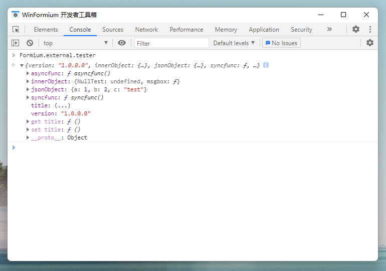
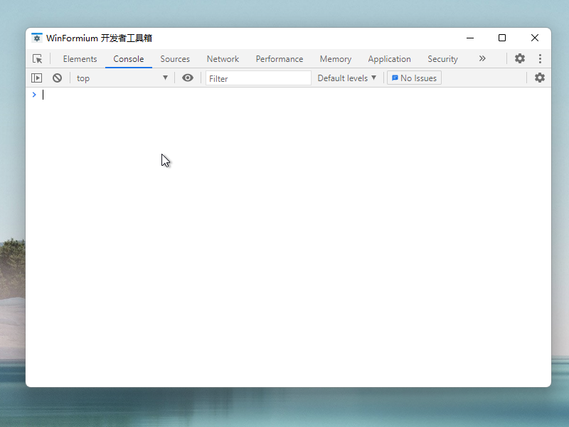

# 注册 JavaScript 对象

[[返回目录](README.md)]

- [注册 JavaScript 对象](#注册-javascript-对象)
  - [创建对象](#创建对象)
  - [注册对象](#注册对象)
  - [调用](#调用)

很多情况下需要向 JavaScript 环境中注册 .NET 相关对象以扩展 NanUI 应用程序的功能，NanUI 提供了这种能力。使用`JavaScriptValue`创建对象并绑定 .NET 对象的映射，之后使用 Formium 窗体的`RegisterExternalObjectValue`方法把`JavaScriptValue`创建的对象注册到前端页面 JavaScript 环境的`Formium.external`对象中。

## 创建对象

使用 JavaScriptValue 创建对象，可以为 JavaScriptValue 对象添加`属性`，`值`，`同步方法`，`异步方法`这几种数据类型。具体请看以下示例。

```C#
var obj = new JavaScriptObject();

//注册只读属性
obj.DefineProperty("now", () => new JavaScriptValue(DateTime.Now));

//注册值
obj.Add("version", Assembly.GetExecutingAssembly().GetName().Version?.ToString());

//注册可读写属性
obj.DefineProperty("title", 
  // Getter
  () => new JavaScriptValue(Title), 
  // Setter
  (v) =>
  {
      InvokeIfRequired(() => Title = v);
  }
);

//注册同步方法
obj.Add("messagebox", (args =>
{
  var msg = args.FirstOrDefault(x => x.IsString)?.GetString() ?? "Nothing";

  var text = msg?.GetString();

  InvokeIfRequired(() =>
  {
      // WindowHWND - 承载窗体Win32句柄
      MessageBox.Show(WindowHWND, text, "Message from JS", MessageBoxButtons.OK, MessageBoxIcon.Information);
  });

  return new JavaScriptValue(text);
}));

//注册异步方法
obj.SetValue("asyncmethod", async (args, promise) =>
{
    var delayedExpire = new Random().Next(3000);

    await Task.Delay(delayedExpire);

    promise.Resovle(new JavaScriptValue($"[RESOLVE] Delayed for {delayedExpire} ms"));

    //promise.Reject($"[REJECT]: Something goes wrong in {delayedExpire} ms");

});
```

## 注册对象

然后将这个对象注册到 JavaScript 环境的`Formium.external`里，并取名`tester`。

```C#
RegisterJavaScriptObject("tester", obj);
```

## 调用

注册成功后即可在前端环境中调用已注册的对象，实现数据交换以及方法调用等。



调用 tester 对象的只读属性 now。

```console
> Formium.external.tester.now
< Thu Oct 29 2020 23:12:19 GMT+0800 (中国标准时间)
```

测试异步方法

**Resovle**
```console
> new Promise(Formium.external.tester.asyncmethod()).then(r=>console.log(r)).catch(e=>console.log(e))
< [RESOLVE] Delayed for 1433 ms
```

**Reject**
```console
> new Promise(Formium.external.tester.asyncmethod()).then(r=>console.log(r)).catch(e=>console.log(e))
< Error: [REJECT]: Something goes wrong in 886 ms
```


