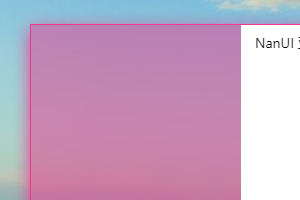
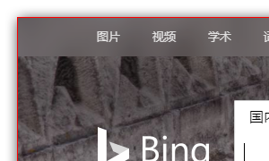
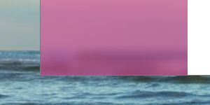
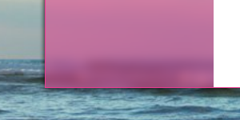
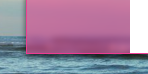

# 使用无边框样式窗体

[[返回目录](README.md)] [[返回正文](nanui-formium.md#窗体样式)]

- [使用无边框样式窗体](#使用无边框样式窗体)
  - [BorderEffect 边框效果](#bordereffect-边框效果)
  - [ShadowEffect 阴影效果](#shadoweffect-阴影效果)

为 Formium 窗体的`WindowType`指定属性值`Borderless`即可将窗体样式设置为无边框样式。无边框样式移除了原生系统的标题栏和边框，您可以使用整个窗体区域来绘制您的应用程序界面。

无边框窗体具备特有的样式属性集合，您可以通过`BorderlessWindowProperties`属性来访问这些内容。下面，将详细介绍这些属性。

## BorderEffect 边框效果

NanUI 为 Formium 的无边框窗体内置了三种样式：`无边`、`线框边框`、`圆角边框`。

- **None**

  无边样式，设置此样式后 Formium 窗体将不绘制边线，浏览器占满所有客户区域范围。

  ```C#
  BorderlessWindowProperties.BorderEffect = BorderEffect.RoundCorner;
  ```

  

  您可以使用 CSS 的 Border 属性来为顶层元素设置边框也能实现具备边线的效果。

  

  ```html
  <div class="main-window">contents...</div>
  ```

  ```css
  .main-window {
    height: 100%;
    box-sizing: border-box;
    border: 1px solid #666;
  }
  ```

- **BorderLine**

  边线边框样式，设置此样式后窗体边缘将由 .NET 绘制边框。

  ```C#
  BorderlessWindowProperties.BorderEffect = BorderEffect.BorderLine;
  BorderlessWindowProperties.BorderColor = Color.Red;
  // BorderlessWindowProperties.InactiveBorderColor = Color.DarkRed;
  ```

  设置`BorderColor`属性来设置窗体激活状态时的边框颜色；设置`InactiveBorderColor`属性来设置非激活状态时的边框颜色。`InactiveBorderColor`设置为 NULL 时，NanUI 将自动通过`BorderColor`的色彩值为 Formium 窗体的边框计算一个合适的色彩。

  

- **RoundCorner**

  设置圆角边框样式后，窗体的四角将呈现为圆角，窗体整体变为圆角矩形。不建议为圆角边框窗体设置边线效果，因为四角的边线将被截去。

  ```C#
  BorderlessWindowProperties.BorderEffect = BorderEffect.RoundCorner;
  ```

  

## ShadowEffect 阴影效果

Formium 无边框窗体的`ShadowEffect`属性体有四种可选的效果：`无阴影`、`光晕`、`阴影`和`投影`。

```C#
BorderlessWindowProperties.ShadowEffect = BorderEffect.Shadow;
```

- **None**

  无阴影。关闭 Formium 窗体的阴影效果。

  

- **Glow**

  光晕效果。

  

- **Shadow**

  阴影效果。

  

- **DropShadow**

  投影效果。

  

阴影同样支持设置颜色。设置`ShadowColor`属性来设置窗体激活状态时的阴影颜色；设置`InactiveShadowColor`属性来设置非激活状态时的阴影颜色。`InactiveShadowColor`设置为 NULL 时，NanUI 将自动通过`ShadowColor`的色彩值为 Formium 窗体的阴影计算一个合适的色彩。
