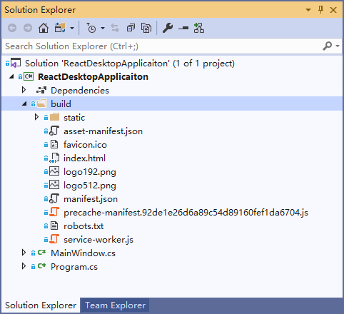

# 内嵌资源处理器

内嵌资源处理器（AssemblyResourceHandler）用于加载作为嵌入资源被打包到程序集里的各种资源文件。这也是 NanUI 应用程序最常见的资源打包方式。

有关于资源处理器的运作原理，请参考[《实现您自己的资源处理器》](custom-resource-handler.md)。如果需要了解更详细的实现细节，请参考[此文档](https://bitbucket.org/chromiumembedded/cef/wiki/GeneralUsage#markdown-header-scheme-handler)。

本章节涉及的内容

- [安装](#安装)
- [打包](#打包)
- [注册资源访问入口](#注册资源访问入口)
- [使用资源](#使用资源)

## 安装

在安装内嵌资源处理器前，请确保您的项目已正确的安装并引用了 NanUI 的基础库以及运行时依赖项。同样推荐使用 NuGet 包管理器来安装内嵌资源处理的 NuGet 包，在包管理器中输入下面的命令来安装：

```
PM> Install NetDimension.NanUI.AssemblyResourceHandler
```

## 打包

在您开的前端界面设计制作完成后，您可以使用您所熟悉的任何打包工具（例如 Webpack）对您的项目进行打包和发布。

以 ReactJS 打包的项目为例：

```
> npm run build
```

当您运行了上述打包命令后，打包工具将打包您的项目，并发布到&lt;your_react_app&gt;\\build 文件夹中，您需要将此文件夹拷贝至您的.NET 项目文件中，目录的名称您可以保留 build 或者其他您喜欢的任何名字。



拷贝完成后，您需要手动选择该文件夹中有可能访问到的文件（例如.map 之类的文件只在调试时有用，软件正常运行时并不需要，所以它们应该被排出到“可能访问到的文件”以外。），并通过**属性窗口**（Properties Window）为该文件设置**生成操作**（Build Action）为**嵌入的资源**（Embedded Resource）


遵循上述操作，当您的项目成功编译时，选中的资源就自动打包到您的程序集中了。

## 注册资源访问入口

资源成功打包后，您还需要为这些资源文件注册一个可以访问的入口。在 NanUI 初始化时，使用内嵌资源处理器的扩展方法`UseAssembledResource`来注册嵌入到程序集里的资源文件。

```C#
Bootstrap
    .Initialize()
    // ...
    .UseAssembledResource(System.Reflection.Assembly.GetExecutingAssembly(), ResourceHandlerScheme.Http, "www.app.local", "build")
    // ...
    .Run(() => // ...);
```

UseAssembledResource 方法具有 4 个参数：

- `assembly` - type: _System.Reflection.Assembly_
- `scheme` - type: _ResourceHandlerScheme [`Http`|`Https`]_
- `domain` - type: _string_
- `basePath` - type: _string(optional)_

**assembly**

此参数既是您打包资源的程序集。如代码示例所示，如果您的资源打包到当前程序集，使用 Assembly 类的 GetExecutingAssembly()来获取当前运行的程序集作为 UseAssembledResource 的参数，内嵌资源处理器将会从此程序集里加载请求的资源。

**scheme**

此参数指定了访问资源所需要的 Http Scheme，目前仅提供 Http 和 Https 两种枚举可供选择。

**domain**

此参数指定了一个虚假域名作为访问资源的地址。如代码示例所示，域名`www.app.local`是一个不存在的假域名[^1]。指定该域名后，您就可以在 NanUI 的前端环境中使用该域名来加载嵌入资源。

需要注意的是，如果您指定了一个能够正常访问的万维网域名，您在当前**应用程序作用域内**，将不能再访问到该域名指向的万维网服务器上的真实内容。简单来说，如果您指定的域名是`www.google.com`，那么在当前应用程序范围内，所有指向`www.google.com`的链接都将映射到您的程序集资源上，如果该链接请求的资源名称在您的程序集中不存在，那么将返回 404 错误。

还需要说明的是，此操作只会影响当前运行的应用程序实例的行为，而不会影响到其他的应用程序，例如您系统里的浏览器。也就是说，您指定的域名，用您系统里的浏览器是无法访问的；同样的，即使您指定了`www.google.com`作为您资源的域名，除此应用程序外，也不会影响到其他软件正常访问谷歌网站。

**bathPath(可选参数)**

如上述示例所示，build 文件夹存放于您项目的根目录。在不指定**basePath**参数的情况下，如果您想访问 build 文件夹里的 index.html 文件，你需要通过`http://www.app.local/build/index.html`才能正确的定位到程序集里的 index.html 文件。所以，将此参数指定为`build`之后，您就可以 z 直接使用`http://www.app.local/index.html`访问到程序集里的 index.html 文件了。

建议不要将您生成的前端文件文件夹内容平铺展开到.NET 项目的根目录中，这样不方便您区分前端项目的文件和.NET 项目本身的文件，还是建议您将前端文件单独放置于独立的文件夹中，保持.NET 项目结构的清晰，也方便您管理。

## 使用资源

至此，您可以在 NanUI 的 Web 环境中尝试使用任何您熟悉的方式，通过指定的协议和域名访问到您内嵌到程序集中的文件。就如同访问万维网上的资源一样方便。

您可以直接使用内嵌资源处理器设置的 Url 地址（例如示例中的：`http://www.app.local/index.html`）作为 NanUI 浏览器承载窗口 Formium 的启动 Url，在应用程序启动时直接呈现内嵌资源中的内容。

[^1]: FileResourceHandler 已默认允许了所有的跨域请求，所以您不仅能从本地访问到文件夹中的内容，也可以从 Internet 的网站上访问这些资源。
