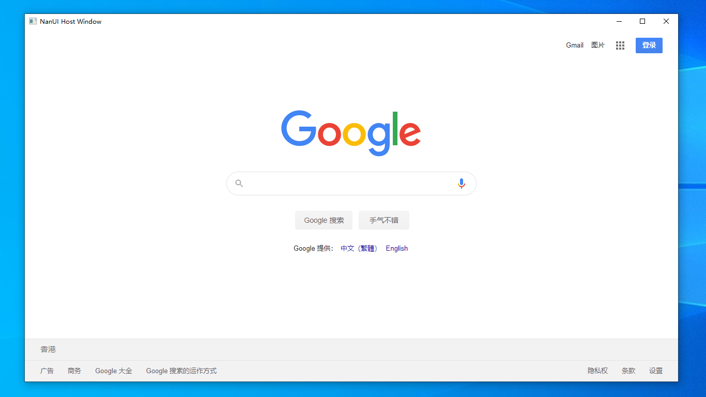
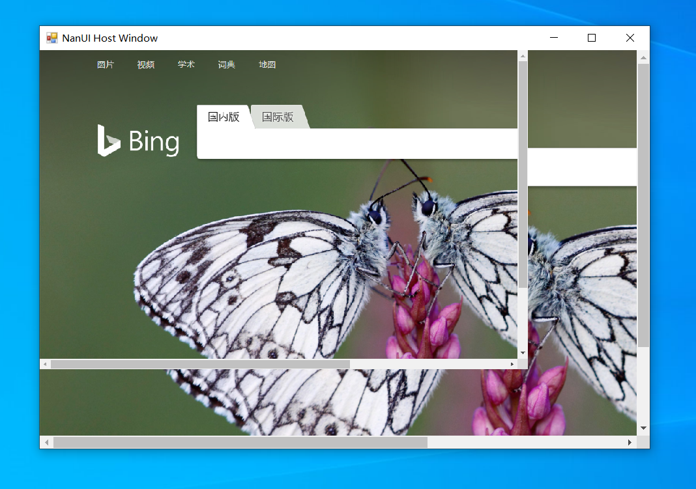
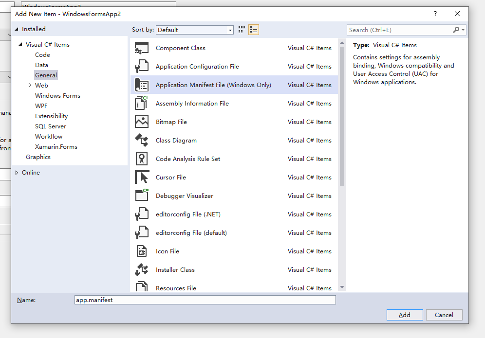
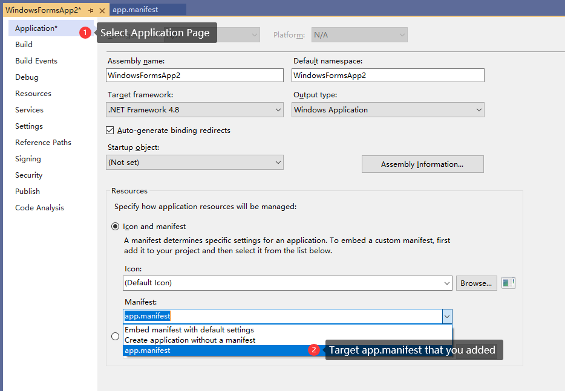

# 创建第一个 NanUI 应用程序

NanUI 基于 Chromium 浏览器核心，因此您可以使用您所熟悉的任何前端技术来打造您的桌面应用程序。您还可以向 Javascript 环境中注入.NET 对象或方法；另外使用资源处理器，您还可以方便地向 Web 环境提供文件、多媒体和数据等内容。

您可以把 NanUI 看作一个嵌入到 WinForm 中的、精简化的 Chromium 浏览器，这个浏览器替代了传统 WinForm 界面的画布，因此您可以发挥想象力，使用任何 Web 前端技术来设计您的窗体界面。

不仅如此，您还能保留.NET 框架的所有特性，能够使用 EntityFramework，能够使用多线程、甚至能通过任何方式与您的硬件设备进行交互并把相关的信息反馈给 Web 环境。既满足了设计漂亮用户界面的需求，也保留了.NET 强大的生态环境。

阅读下面的步骤，我们就来一起创建您的第一个 NanUI 应用程序。

- [选择一种.NET 框架](#选择一种.net框架)
- [安装 NanUI](#安装-nanui)
- [制作一个简易的 HTML 窗体](#制作一个简易的-html-窗体)
- [初始化 NanUI 和 Chromium Embedded 框架环境](#初始化-nanui-和-chromium-embedded-框架环境)
- [进一步定制您的窗口](#进一步定制您的窗口)
- [运行您的第一个 NanUI 应用程序](#运行您的第一个-nanui-应用程序)
- [可能遇到的问题](#可能遇到的问题)

## 选择一种.NET框架

您可以根据实际项目的需求，选择使用针对于.NET Framework 或者.NET Core 框架的的 Windows 窗体（WinForm）应用程序。对于两种类型的窗体应用程序来说，所有的 API 接口都是相同的，您可以方便的从一种框架迁移到另外一种。


## 安装 NanUI

现在，您需要安装 NanUI 以及 NanUI 的依赖项。推荐您使用 NuGet 包管理起来安装他们。在包管理器中运行如下命令来安装：

**安装 NanUI**

```
PM> Install-Package NetDimension.NanUI
```

**安装 NanUI 运行时依赖项**

```
PM> Install-Package NetDimension.NanUI.Runtime
```

## 制作一个简易的 HTML 窗体

NanUI 使用了新的工厂来创建浏览器承载窗口`Formium`，因此我们并不需要像往常一样通过窗体设计器来设计窗体和控件。因此我们可以直接删除项目模板中为我们自动创建的 Form1.cs 窗体。

新建 MainWindow.cs，并让他继承 NetDimension.NanUI.Formium 基类，并实现该类的所有抽象接口：

```C#
using NetDimension.NanUI;
using NetDimension.NanUI.Browser;

class MainWindow : Formium
{
    public override string StartUrl => "https://www.google.com";

    public override HostWindowType WindowType => HostWindowType.Standard;

    protected override Control LaunchScreen => null;

    public MainWindow()
    {
        Title = "第一个NanUI应用"
    }

    protected override void OnWindowReady(IWebBrowserHandler browserClient)
    {

    }

    protected override void OnRegisterGlobalObject(JSObject global)
    {

    }
}
```

修改 StartUrl 属性，指定启动时访问的 Url 地址。

```C#
public override string StartUrl => "https://www.google.com";
```

指定 WindowType 属性，选择窗体以原生样式显示还是使用无边框样式。

```C#
 public override HostWindowType WindowType => HostWindowType.Standard;
```

使用 LaunchScreen 属性来返回一个自定义的用户控件，用来显示网页加载时的等待画面，通常他可以是一个 PictureBox，放置一张静态的图像或者 GIF 图像来告知用户应用程序启动的状态。如果不需要该功能，返回 null 即可。

```C#
protected override Control LaunchScreen => null;
```

使用 OnWindowReady 重载方法，您可以 browserClient 参数来设置 Chromium 客户端的各个处理器，以此来实现 Chromium 浏览器的各项行为，例如：如何处理新开窗口、如何处理下载请求、如何通知应用程序网页标题的改变等等行为。

这个方法通常在 Chromium 浏览器核心初始化完成之后执行。

如果不需要定义行为处理器，那么留空即可。

```C#
protected override void OnWindowReady(IWebBrowserHandler browserClient)
{

}
```

使用 OnRegisterGlobalObject 重载方法，您可以向浏览器的 Javascript 上下文注册各种.NET 对象和方法，您可以把该重载方法的参数 global 看作浏览器的 window 对象。具体的实现方法可以参考后面章节。

```C#
protected override void OnRegisterGlobalObject(JSObject global)
{

}
```

通过以上操作您就完成了您的第一个 NanUI 窗口，该窗口将使用 google.com 的内容作为您窗体的界面。

但是到目前为止，应用程序还不能正常运行，因为我们还需要初始化 NanUI 和 CEF 环境。

## 初始化 NanUI 和 Chromium Embedded 框架环境

初始化 NanUI 和 CEF 的操作我们需要放在 Main 方法中。

```C#

using NetDimension.NanUI;

static class Program
{
    /// <summary>
    ///  The main entry point for the application.
    /// </summary>
    [STAThread]
    static void Main()
    {
        Bootstrap
            .Initialize()
            .Run(() => new MainWindow());
    }
}
```

至此，您的第一个 NanUI 应用程序已经能够正常运行了。

## 进一步定制您的窗口

如果您还想进一步定制您的窗口样式，请重载 OnStandardFormStyle 方法，并使用 style 参数来设置窗口启动位置、大小、图标、边框样式等信息。

```C#
protected override void OnStandardFormStyle(IStandardHostWindowStyle style)
{
    base.OnStandardFormStyle(style);

    style.Width = 1280;
    style.Height = 720;
    style.Icon = System.Drawing.SystemIcons.WinLogo;
    style.StartPosition = FormStartPosition.CenterScreen;
}
```

## 运行您的第一个 NanUI 应用程序

如果一切正常，那么您的第一个 NanUI 应用程序就应该如下图所示，成功运行了。



## 可能遇到的问题

### 1. Windows 在高 DPI 显示器下启用了自定义缩放级别

当您成功运行 NanUI 应用程序后，如果看到的画面与下图所示一样，有大小两个相同界面且不停闪烁。



那么，您需要手动添加应用程序清单文件 app.manifest，并且在项目属性的页面的 Application 选项卡中选择您手动添加的这个清单文件。





取消 app.manifest 文件中关于 HighDPI 支持段落的注释。

```xml
<application xmlns="urn:schemas-microsoft-com:asm.v3">
    <windowsSettings>
        <dpiAware xmlns="http://schemas.microsoft.com/SMI/2005/WindowsSettings">true</dpiAware>
    </windowsSettings>
</application>
```

如果您想启用多显示器不同 DPI 级别的缩放（Windows 8.1 或更高版本系统支持），您还需要加上以下代码。

```xml
<application xmlns="urn:schemas-microsoft-com:asm.v3">
    <windowsSettings>
        ...
        <dpiAwareness xmlns="http://schemas.microsoft.com/SMI/2016/WindowsSettings">PerMonitor</dpiAwareness>
    </windowsSettings>
</application>
```

如果您想启用多显示器不同 DPI 级别的拖动缩放特性（Windows 10 创意者更新或更高版本），那么请把上面的代码更改为下面的参数。

```xml
<application xmlns="urn:schemas-microsoft-com:asm.v3">
    <windowsSettings>
        <dpiAware xmlns="http://schemas.microsoft.com/SMI/2005/WindowsSettings">true</dpiAware>
        <dpiAwareness xmlns="http://schemas.microsoft.com/SMI/2016/WindowsSettings">PerMonitorV2</dpiAwareness>
    </windowsSettings>
</application>
```

如果您的应用程序基于 .NET CORE 3.1 框架，那么您还需要在 Main 方法种添加下述代码。

```C#
static void Main()
{
    Application.SetHighDpiMode(HighDpiMode.SystemAware);
    // ...
}
```

### 2. 页面中的工具提示（Tooltips）不显示

如果遇到此问题，同样在应用程序清单文件 app.manifest 中，取消下面所示内容的注释即可。

```xml
<!-- Enable themes for Windows common controls and dialogs (Windows XP and later) -->

<dependency>
<dependentAssembly>
    <assemblyIdentity
        type="win32"
        name="Microsoft.Windows.Common-Controls"
        version="6.0.0.0"
        processorArchitecture="*"
        publicKeyToken="6595b64144ccf1df"
        language="*"
    />
</dependentAssembly>
</dependency>
```
