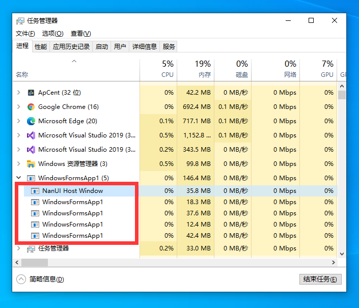
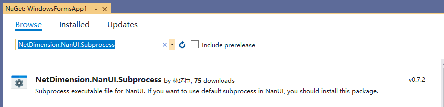
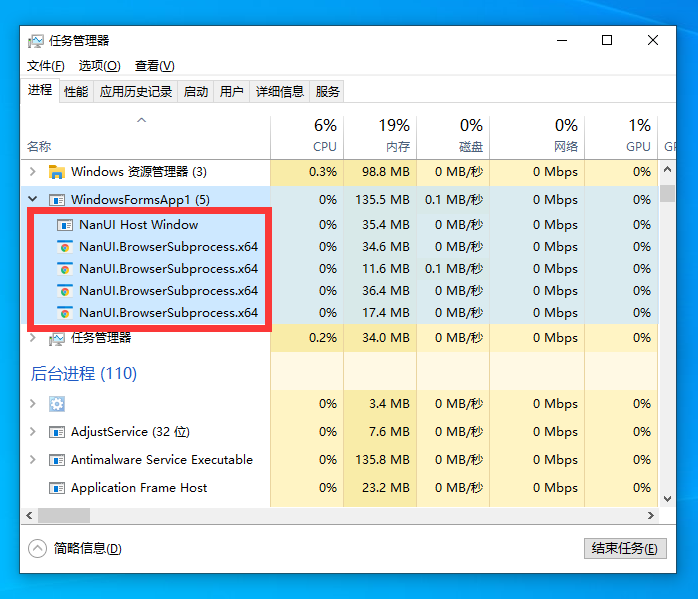

# NanUI 子进程应用

CEF 使用多进程模型。其中包括：一个浏览器进程、一个渲染进程和若干其他进程（处理插件的进程、处理GPU的进程等）。
- 浏览器进程处理窗口的创建和绘制，以及网络访问等，浏览器进程包含了应用程序的主要逻辑。
- 渲染进程负责渲染 HTML 以及执行 JavaScript ，访问 DOM 等。
- 其他进程则进行插件处理，GPU 处理等（如果有的话）。
- 多个进程之间通过 IPC (Inter-Process Communication) 通信。

默认情况下CEF使用一个可执行程序的多个实例来实现上述的多个进程。NanUI继承了此特性，在NanUI的初始化过程中将调用CEF框架的ExecuteProcess方法来根据不同的命令行参数执行不同的进程，如果是浏览器进程，该函数立即返回，返回值为 -1。如果是其他进程，则在浏览器退出时才返回，返回值是一个大于0的数。因此基于NanUI开发的应用程序启动后都将启动至少三个进程。



您也可以在CEF启动前通过设置BrowserSubprocessPath来以不同的子进程应用程序实现CEF的多进程。

NanUI已为您提供了子进程应用程序。

## 安装NanUI子进程应用程序

您可以通过NuGet包管理器来安装NanUI子进程应用程序。

```
PM> Install-Package NetDimension.NanUI.Subprocess
```




安装NanUI子进程应用程序包后，NanUI会自动根据您的系统架构选择针对.NET Framework / .NET Core框架的x86/x64应用程序。

## 在您的应用中激活NanUI子进程应用程序

在初始化CEF之前使用下面的代码您可以激活这一特性。

```C#
Bootstrap
    .Initialize()
    .UseDefaultBrowserSubpress() //激活NanUI子进程应用程序
    .Run(() => ...);
```

使用以上代码，再次启动您的应用程序，NanUI子进程将替代之前您自己的应用程序可执行文件。



通过使用子进程应用程序，您可以方便的用传统的单例应用程序实例检测方法来保证只执行一个应用程序实例。

不使用NanUI子进程应用方式您很难实现单例应用程序实例的检测，因为CEF是多进程的，使用传统单例应用程序实例检测的方法会导致无法启动子进程，从而导致应用程序渲染失败。

